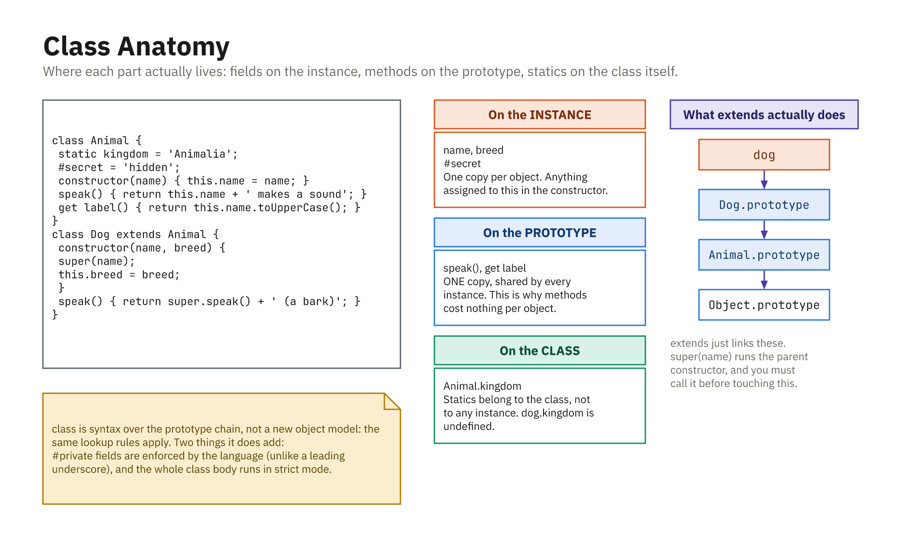

# JavaScript Classes

In JavaScript, a **class** is a **blueprint** for objects. Write the blueprint once, then stamp out as
many objects as you like from it, each one with the same shape and the same abilities.

A class describes two things:

- **what data an object has** (properties)
- **what an object can do** (methods)

That makes classes a natural fit whenever you have many objects that share the same structure and
behavior, such as users, products, or game characters. Instead of hand-building each object, you
describe the pattern once and let the class do the repetitive work.



*Fields live on the instance, methods on the prototype, statics on the class.*

---

## Basic Class Definition

You create a class with the `class` keyword.

```js
class Person {
  // constructor runs when you create a new Person
  constructor(name, age) {
    this.name = name;
    this.age = age;
  }

  // method
  sayHello() {
    console.log("Hi, my name is " + this.name);
  }
}

// create objects (instances) from the class
const alice = new Person("Alice", 25);
const bob = new Person("Bob", 30);

alice.sayHello(); // "Hi, my name is Alice"
bob.sayHello();   // "Hi, my name is Bob"
```

* `class Person { ... }` → defines the class
* `constructor` → special method that sets up new objects
* `this.name`, `this.age` → properties on the object
* `new Person(...)` → creates a new **instance** of the class

---

## Constructor and `this`

The `constructor` runs automatically when you use `new`. Its job is to set up the fresh object.

Inside a class, `this` refers to **the specific object** being created or used, meaning the individual
instance, not the class as a whole.

```js
class Car {
  constructor(brand, year) {
    this.brand = brand;
    this.year = year;
  }

  getInfo() {
    return this.brand + " (" + this.year + ")";
  }
}

const car1 = new Car("Toyota", 2020);
console.log(car1.getInfo()); // "Toyota (2020)"
```

Each `Car` object gets its **own** `brand` and `year`.

---

## Adding Methods

Methods are just functions that live inside the class. Every instance shares the same methods, but
each one acts on its own data through `this`.

```js
class Counter {
  constructor() {
    this.value = 0;
  }

  increment() {
    this.value++;
  }

  reset() {
    this.value = 0;
  }
}

const counter = new Counter();
counter.increment();
counter.increment();
console.log(counter.value); // 2
counter.reset();
console.log(counter.value); // 0
```

---

## Class Fields (Properties with Default Values)

You can declare properties right at the top of the class, with a default value. This is handy when a
property should start the same way for every instance, so you don't have to set it in the constructor.

```js
class Player {
  score = 0;      // default value
  lives = 3;      // default value

  constructor(name) {
    this.name = name;
  }

  addScore(points) {
    this.score += points;
  }
}

const p = new Player("Sam");
p.addScore(10);
console.log(p.score); // 10
```

These are **public** fields: anyone can read or overwrite `p.score` from outside. That's fine much of
the time, but sometimes you want to protect a value so it can only be changed through your own methods.
That's where private fields come in.

---

## Private Fields and Accessors (Encapsulation)

**Encapsulation** means keeping an object's internal data hidden and only letting the outside world
touch it through methods you approve. It stops other code from putting an object into a bad state.

Modern JavaScript (ES2022, now Baseline in every current browser and Node) gives classes a built-in
way to do this: prefix a field name with `#` to make it **private**. A `#` field can only be read or
written from *inside* the class; reaching for it from outside is a syntax error, not just a
convention.

```js
class BankAccount {
  #balance = 0; // private - declared with #

  constructor(startingBalance = 0) {
    if (startingBalance < 0) {
      throw new Error("Starting balance cannot be negative");
    }
    this.#balance = startingBalance;
  }

  // a getter exposes a read-only view of the private data
  get balance() {
    return this.#balance;
  }

  // the only approved way to change the balance
  deposit(amount) {
    if (amount <= 0) {
      throw new Error("Deposit must be a positive number");
    }
    this.#balance += amount;
    return this.#balance;
  }
}

const account = new BankAccount(100);

console.log(account.balance);     // 100 (through the getter)
console.log(account.deposit(50)); // 150
console.log(account.balance);     // 150

// account.#balance;  // SyntaxError - truly private, unreachable from outside
```

Because `deposit` is the only door into `#balance`, there's no way for outside code to sneak in a
negative or nonsensical value. Every change runs through your validation.

### Getters and setters validate on assignment

A **getter** lets you expose a value as if it were a plain property, and a **setter** lets you run a
check every time someone assigns to it. Callers write `obj.celsius = 25` (clean, ordinary-looking
property syntax) while your setter quietly guards the data.

```js
class Thermostat {
  #celsius = 20;

  get celsius() {
    return this.#celsius;
  }

  set celsius(value) {
    if (value < -273.15) {
      throw new Error("Temperature is below absolute zero");
    }
    this.#celsius = value;
  }

  get fahrenheit() {
    return this.#celsius * 9 / 5 + 32; // derived, read-only
  }
}

const t = new Thermostat();
t.celsius = 25;         // runs through the setter (validated)
console.log(t.celsius);    // 25
console.log(t.fahrenheit); // 77
```

If you've read the closures chapter, you've already seen one way to get private state: a bank account
whose `balance` lived inside a closure. Private fields are the **language-level** version of that same
idea: instead of hiding data in a function's scope, you hide it behind `#` inside a class. Reach for
whichever fits your design; both give you genuinely private data.

---

## Static Methods

A `static` method belongs to the **class itself**, not to any individual object. It's a good home for
helper functions that relate to the class but don't need a particular instance's data.

```js
class MathHelper {
  static double(x) {
    return x * 2;
  }
}

console.log(MathHelper.double(5)); // 10
```

You call static methods on the class (`MathHelper.double`), not on an instance.

---

## Inheritance (`extends`)

A class can **extend** another class to reuse its behavior and add more on top, so you don't repeat
what the parent already does.

```js
class Animal {
  constructor(name) {
    this.name = name;
  }

  speak() {
    console.log(this.name + " makes a sound.");
  }
}

class Dog extends Animal {
  constructor(name, breed) {
    super(name); // call Animal's constructor
    this.breed = breed;
  }

  speak() {
    console.log(this.name + " barks!");
  }
}

const d = new Dog("Rex", "Labrador");
d.speak(); // "Rex barks!"
```

* `extends Animal` → `Dog` inherits from `Animal`
* `super(name)` → calls the parent class constructor
* You can **override** methods like `speak()` to change behavior.

---

## Simple DOM Example with a Class

```html
<!DOCTYPE html>
<html>
  <body>
    <button id="like-btn">Like</button>
    <span id="like-count">0</span>

    <script>
      class LikeButton {
        constructor(buttonElement, countElement) {
          this.button = buttonElement;
          this.countElement = countElement;
          this.count = 0;

          this.button.addEventListener("click", () => {
            this.increment();
          });
        }

        increment() {
          this.count++;
          this.countElement.textContent = this.count;
        }
      }

      const btn = document.getElementById("like-btn");
      const countSpan = document.getElementById("like-count");

      const likeButton = new LikeButton(btn, countSpan);
    </script>
  </body>
</html>
```

The `LikeButton` class:

* keeps track of its own `count`
* updates the DOM whenever the button is clicked

---

## Summary

* Classes are **blueprints** for creating objects with shared properties and methods.
* Use:

  * `class` to define a class
  * `constructor` to set up new objects
  * `this` to refer to the current object
  * `extends` and `super` for inheritance
  * `static` for class-level utility methods
* **Encapsulate** internal data with `#` **private fields**, and expose or guard it with **getters and
  setters**, the language-level version of the closure-based privacy from the closures chapter.
* Classes help organize code, especially in larger apps with many similar objects.
