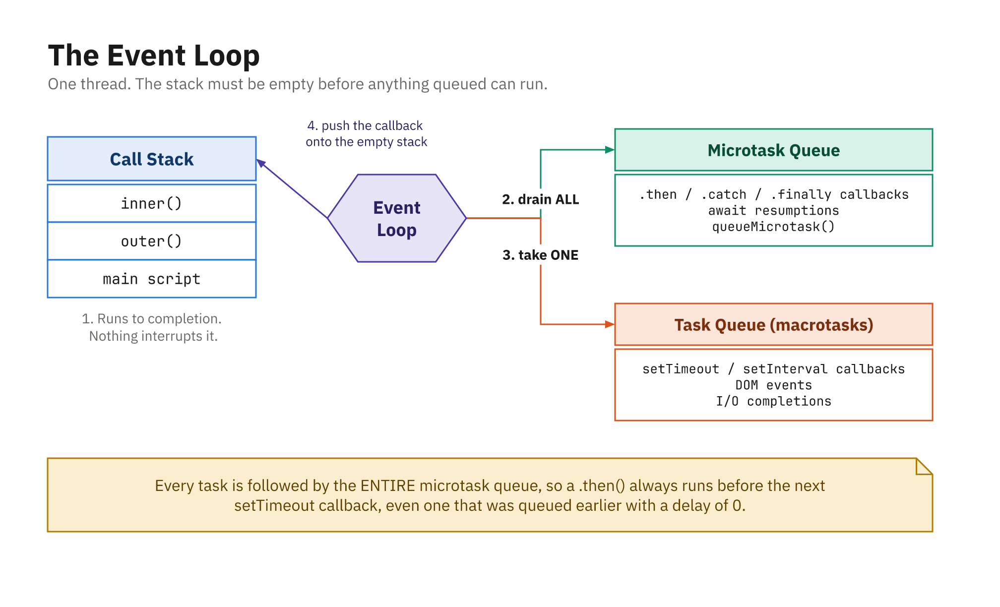

# JavaScript and the Event Loop

JavaScript is single-threaded, yet somehow it juggles timers, network requests, and user
clicks without ever freezing up. The **event loop** is the system that makes that possible:
it's how a language that can only do one thing at a time still handles many asynchronous
operations gracefully. Once you can picture how it works, the ordering of async code stops
feeling like magic.



*Synchronous code always finishes first, then **all** microtasks, then **one** task.*

---

## Single-threaded execution

JavaScript runs in a single thread, which means it can only do one thing at a time and each
piece of code must finish before the next one starts. There is no "meanwhile, over on another
thread"; everything happens in sequence. The place where the currently running code lives is
called the **call stack**: functions are pushed on as they're called and popped off as they
return.

---

## Role of the environment

On its own, the JavaScript language has no idea how to set a timer or make a network request.
Those features come from the **host environment** (the browser or Node.js), which layers on
extra capabilities such as:

* Timers (like timeouts and intervals)
* Network requests
* DOM events (click, input, and so on)

In the browser these are often called Web APIs; in other environments they go by host APIs.
Either way, they live outside the JavaScript engine. When you use one of these features, the
environment starts the work in the background, and when the work is ready it places your
callback into a **queue** to be run later.

---

## Queues: tasks and microtasks

Callbacks don't all wait in the same line. There are two main queues, and they have different
priorities. The **task queue** (also called the macro task queue) holds callbacks for things
like timers, UI events, and some network operations. The **microtask queue** holds smaller,
higher-priority work, mainly promise callbacks.

The important rule is this: after each main task finishes, the event loop runs **all** pending
microtasks before moving on to the next main task. That priority is why a promise callback
often runs **before** a timeout callback, even when the timeout's delay is tiny.

Here is the whole idea in four lines. Read the source order, then the output:

```js
console.log("1: synchronous");

setTimeout(() => console.log("4: timeout callback (task)"), 0);

Promise.resolve().then(() => console.log("3: promise callback (microtask)"));

console.log("2: synchronous");
```

```
1: synchronous
2: synchronous
3: promise callback (microtask)
4: timeout callback (task)
```

Nothing asynchronous runs until the synchronous code is finished, which is why `2` beats `3`, even
though the promise was already resolved. Then the microtask goes ahead of the task, even though the
timeout asked for `0` milliseconds. **A delay of `0` means "as soon as possible", not "now".**

Microtasks drain *completely* before the next task, not one per turn:

```js
setTimeout(() => console.log("task"), 0);

Promise.resolve()
  .then(() => console.log("microtask 1"))
  .then(() => console.log("microtask 2"));
```

```
microtask 1
microtask 2
task
```

The second `.then` is queued *while* the first microtask is running, and the loop still services it
before returning to the task queue.

---

## What the event loop actually does

You can picture the event loop as a simple cycle that repeats forever:

1. If the **call stack** is empty, take the **next task** from the task queue and run it.
2. When that task finishes, run **all microtasks** waiting in the microtask queue.
3. Let the browser **update the screen** (paint, layout, and so on).
4. Repeat.

Spinning through this loop is what keeps your app responsive while it manages many small
asynchronous operations behind the scenes.

---

## Blocking the event loop

The catch is that the loop can only turn when the call stack is empty. If you run heavy,
synchronous work (a long loop that grinds for a few seconds, say), the call stack stays busy
the whole time. While it's busy, the event loop can't pull anything from the queues, so timers,
promise callbacks, and UI events all appear "stuck."

You can watch it happen. This timer asks for `0` milliseconds but does not run for a full second:

```js
setTimeout(() => console.log("timer callback - finally!"), 0);

const start = Date.now();
while (Date.now() - start < 1000) {
  // deliberately blocking the call stack
}
console.log("blocked the stack for 1000ms");
```

```
blocked the stack for 1000ms
timer callback - finally!
```

In a browser this is not just a late log: nothing repaints, no button responds, and no text can be
selected for that whole second. The page is frozen. That is why long synchronous work on the main
thread is something to avoid, and why the fix is to break the work into chunks, move it to a Web
Worker, or make it genuinely asynchronous.

---

## Why the event loop matters

Keeping this model in mind pays off in practical ways. It lets you predict **when** async
callbacks will run, avoid UI freezes by not blocking the main thread, use promises and timers
correctly, and reason about ordering: which callback runs first, and why. Once you can
picture the call stack, the two queues, and the loop that ties them together, the rest of async
JavaScript becomes far easier to follow.

---

## Summary

* JavaScript is **single-threaded**: it does one thing at a time on the **call stack**.
* Timers, network requests, and DOM events come from the **host environment** (Web APIs), not the language itself.
* Ready callbacks wait in a **task (macro task) queue** or the higher-priority **microtask queue** (used for promises).
* The **event loop** runs the next task only when the call stack is empty, then drains **all microtasks**, then lets the browser paint.
* Because microtasks run first, **promise callbacks usually run before timer callbacks**, even with a tiny delay.
* **Blocking, heavy synchronous work** freezes everything, so keep the main thread free to stay responsive.
