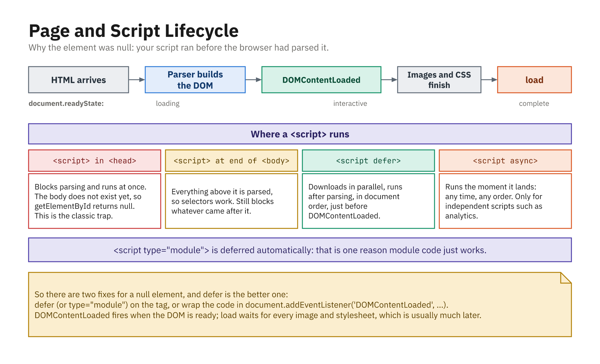

# Browsers and JavaScript Modules

Modern browsers run ES modules natively, with no bundler or build step required. You get both flavors: **static** `import` / `export`, enabled by marking a script with `type="module"`, and **dynamic** `import()` for loading modules at runtime. This chapter is a short, practical look at how each works in the browser.



*Why the element was `null`: the script ran before the browser had parsed it.*

---

## Static Modules With `<script type="module">`

To use `import` / `export` in the browser, tell the browser your script is a module by adding `type="module"`:

```html
<script type="module" src="main.js"></script>
```

Now `main.js` can import from other files:

```js
// main.js
import { add } from "./math.js";
import greet from "./greet.js";

console.log(add(2, 3));
greet("Alice");
```

Those files export their own bindings as usual:

```js
// math.js
export function add(a, b) {
  return a + b;
}
```

```js
// greet.js
export default function greet(name) {
  console.log(`Hello, ${name}!`);
}
```

A few things to remember about module scripts in the browser:

- The `type="module"` attribute is what enables `import` / `export`.
- Module scripts are **deferred** by default: they run after the HTML has finished parsing.
- Imports use **URLs or paths** (`"./math.js"`, `"./utils/helpers.js"`), including the file extension.
- Each file is its **own module** with its own scope.

---

## Inline Module Scripts

You don't need a separate file; you can write module code directly in the HTML:

```html
<script type="module">
  import { add } from "./math.js";

  console.log(add(5, 7));
</script>
```

That's convenient for small demos and prototypes.

---

## Dynamic Modules With `import()`

Dynamic import loads a module at runtime by calling `import()`, which returns a **promise**. Handle it with `.then()` / `.catch()`:

```js
import("./math.js")
  .then((math) => {
    console.log(math.add(10, 20));
  })
  .catch((error) => {
    console.error("Failed to load module:", error);
  });
```

Or with `async/await`:

```js
async function loadMath() {
  try {
    const math = await import("./math.js");
    console.log(math.add(1, 2));
  } catch (error) {
    console.error("Failed to load module:", error);
  }
}

loadMath();
```

The promise resolves to a **module object** whose named exports are properties (`math.add`) and whose default export is `math.default`.

---

## Combining Static and Dynamic Imports

The two styles work well together: load your core code up front with static imports, and defer optional features to a dynamic import that only runs when needed.

```js
// main.js (loaded with <script type="module" src="main.js">)
import { setupPage } from "./setup.js";

setupPage();

document.getElementById("debug-btn").addEventListener("click", async () => {
  const debug = await import("./debug-tools.js");
  debug.openPanel();
});
```

Here `setupPage` is imported **statically** at load time, while `debug-tools.js` is fetched **dynamically** only when the user clicks the button, so visitors who never open the debug panel never download its code.

---

## Summary

- Add `type="module"` to a `<script>` (as a `src` file or inline) to enable **static ES modules** in the browser.
- Use `import` / `export` in your `.js` files to share code; each file is its own scoped module, and module scripts are deferred by default.
- Use `import()` to load modules **dynamically** at runtime; it returns a promise and pairs naturally with `async/await`.
- Static imports resolve at **load time**; dynamic imports resolve **when your code calls `import()`**. Combine them to load core code up front and extra features on demand.
