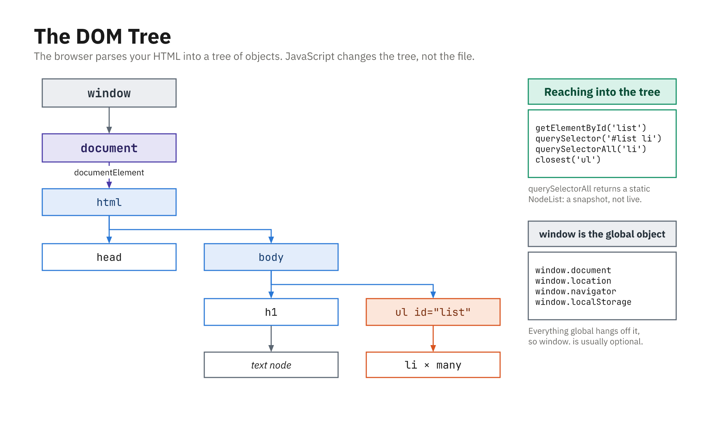

# Web Browser's Document Object

In the browser, the `document` object is your **entry point to the page content**. If `window` represents the tab, then `document` represents the **HTML document inside it**, the tree of elements, text, and attributes that make up what the user sees. You use `document` to reach into the DOM, find elements, create and insert new ones, react when the page is ready, and read basic metadata such as the title and URL. The sections below cover the most practical of those tasks.



*The browser parses your HTML into a tree of objects; JavaScript changes the tree, not the file.*

---

## What is `document`?

At its simplest, `document` is an object representing the loaded HTML. Print it in the console to see the whole tree:

```js
console.log(document);
```

A handful of its properties give you direct access to the page's structural landmarks:

```js
document.documentElement; // <html> element
document.head;            // <head> element
document.body;            // <body> element
document.title;           // page title (in the tab)
document.URL;             // full URL of the document
```

Some of these are writable, not just readable. Setting `document.title`, for instance, changes the text shown on the browser tab:

```js
console.log(document.title);
document.title = 'New title from JS';
```

---

## Running code when the document is ready

Most DOM code needs the elements to exist before it runs, so you want to wait until the page has been parsed. There are two common ways to do that.

### Option 1: `DOMContentLoaded`

The `DOMContentLoaded` event fires as soon as the HTML has been parsed and the DOM is built, so it is the natural place to put startup code:

```js
document.addEventListener('DOMContentLoaded', () => {
  console.log('DOM is ready');
  const btn = document.getElementById('my-button');
  // safe to use btn now
});
```

It fires once the HTML is fully parsed and the DOM tree is in place. Images, CSS, and other sub-resources might still be loading, but the elements themselves are already there and safe to use.

### Option 2: put your `<script>` at the bottom of `<body>`

The other approach is to place your script at the very end of the body, so everything above it has already been parsed by the time it runs:

```html
<body>
  <!-- your HTML here -->
  <script>
    // By now, previous elements are already parsed
    const btn = document.getElementById('my-button');
  </script>
</body>
```

Both patterns are common. When you are learning, the script-at-the-bottom approach is the simplest to reason about.

---

## Selecting elements with `document`

You have seen some of these before, but they are central to how you work with `document`, so they are worth a proper look.

### `getElementById`

`getElementById` grabs a single element by its `id`:

```html
<button id="save-btn">Save</button>
```

```js
const saveBtn = document.getElementById('save-btn');
saveBtn.addEventListener('click', () => {
  console.log('Saving...');
});
```

It is fast and very common. Note that you pass just the id string, with no `#` prefix.

### `querySelector` and `querySelectorAll`

The `querySelector` family works with CSS selectors, so anything you can target in a stylesheet you can target here. Given some markup:

```html
<ul class="menu">
  <li class="item active">Home</li>
  <li class="item">Profile</li>
</ul>
```

you can grab the first match or every match:

```js
// First match
const activeItem = document.querySelector('.menu .item.active');

// All matches
const items = document.querySelectorAll('.menu .item');
items.forEach(item => {
  console.log(item.textContent);
});
```

You call these on `document` when you want to search the whole page.

---

## Creating elements with `document`

To add new content to the page, you build nodes from `document` and then attach them to the tree.

### `document.createElement`

`createElement` makes a fresh element that you can fill in and append:

```js
const p = document.createElement('p');
p.textContent = 'Hello from JS!';
document.body.appendChild(p);
```

### `document.createTextNode` (less common)

You can also create a standalone text node and append it into an element:

```js
const p = document.createElement('p');
const text = document.createTextNode('Hello!');
p.appendChild(text);
document.body.appendChild(p);
```

In practice you will rarely need this; setting `element.textContent = '...'` is usually enough.

---

## Document fragments (optional but handy)

When you need to add a lot of elements at once, a **document fragment** lets you build them off-screen and insert them in a single operation:

```js
const list = document.getElementById('list');
const fragment = document.createDocumentFragment();

for (let i = 1; i <= 5; i++) {
  const li = document.createElement('li');
  li.textContent = 'Item ' + i;
  fragment.appendChild(li);
}

// One append, not 5
list.appendChild(fragment);
```

Because the fragment lives outside the live DOM until that final append, the browser only updates the page once instead of on every loop iteration, which is both faster and easier on the layout engine in big loops.

---

## Accessing `<body>`, `<head>`, and `<html>`

The three structural landmarks each have their own uses.

### `document.body`

The `<body>` is where most of your visible content lives, and you can read or restyle it directly:

```js
console.log(document.body);      // <body>...</body>
document.body.style.background = '#f0f0f0';
```

### `document.head`

The `<head>` holds metadata and styles, and you can add to it at runtime, for example by injecting a new stylesheet:

```js
const link = document.createElement('link');
link.rel = 'stylesheet';
link.href = 'styles/additional.css';
document.head.appendChild(link);
```

### `document.documentElement`

`document.documentElement` is the `<html>` element itself. It comes in handy when you work with CSS variables or need the overall scroll height:

```js
const root = document.documentElement;

// CSS variable
root.style.setProperty('--main-color', 'tomato');

// Scroll height
console.log(root.scrollHeight);
```

---

## Basic document information

The document also exposes some read-mostly information about the page:

```js
console.log(document.title); // get title
document.title = 'New title'; // set title

console.log(document.URL);      // full URL
console.log(document.domain);   // domain (might be restricted by security rules)
console.log(document.referrer); // where the user came from (if available)
```

These are mostly useful for display or analytics rather than for heavy application logic.

---

## Forms and `document.forms`

The document gives you a couple of shortcuts to forms and their fields. Given a named form:

```html
<form id="login-form" name="loginForm">
  <input name="email">
  <input name="password" type="password">
</form>
```

you can reach it and its inputs by name, or with a modern selector:

```js
// Access by name (HTML name attribute) - older style
const formByName = document.forms.loginForm;

// Access input by name
const emailInput = document.forms.loginForm.elements.email;

// More modern: use querySelector
const form = document.getElementById('login-form');
const email = form.querySelector('input[name="email"]');
```

For new code, `querySelector` is usually the clearer choice, but `document.forms` is worth knowing, because you will run into it in older examples.

---

## Document events: click, keydown, etc.

You can attach event listeners directly to `document` to catch events anywhere on the page, which is perfect for behavior that isn't tied to one specific element.

### Example: close a menu when clicking anywhere else

A classic use is a single document-level click handler that closes an open menu when the user clicks outside of it:

```js
document.addEventListener('click', (event) => {
  const menu = document.querySelector('.menu');
  const button = document.querySelector('#menu-button');

  // If click is NOT inside menu or button, close menu
  if (!menu.contains(event.target) && !button.contains(event.target)) {
    menu.classList.remove('open');
  }
});
```

Here `contains` checks whether the click landed inside the menu or its button; if it landed anywhere else, the menu closes.

### Keyboard shortcuts

A document-level `keydown` handler is a natural home for global keyboard shortcuts:

```js
document.addEventListener('keydown', (event) => {
  if (event.key === 'Escape') {
    console.log('Escape pressed - close dialogs, etc.');
  }
});
```

You could attach some of these to `window` instead; both are common in practice.

---

## `document.readyState`

`document.readyState` reports how far the page load has progressed, moving through three values: `"loading"` while the HTML is still being parsed, `"interactive"` once the DOM is built but sub-resources like images may still be arriving, and `"complete"` when everything has finished loading. You can use it to run code immediately if the DOM is already there, or to wait for `DOMContentLoaded` if it is not:

```js
if (document.readyState === 'loading') {
  document.addEventListener('DOMContentLoaded', () => {
    console.log('DOM ready (from loading state)');
  });
} else {
  console.log('DOM already ready');
}
```

This pattern shows up in libraries that might be loaded at different points in a page's lifecycle.

---

## Small practical example: build a list from data

This example ties several `document` features together: selecting an element, creating new ones, and inserting them into the DOM:

```html
<ul id="user-list"></ul>

<script>
  const users = ['Alice', 'Bob', 'Charlie'];
  const list = document.getElementById('user-list');

  // Build list items using document
  const fragment = document.createDocumentFragment();

  users.forEach(name => {
    const li = document.createElement('li');
    li.textContent = name;
    fragment.appendChild(li);
  });

  list.appendChild(fragment);
</script>
```

This one small snippet touches `document.getElementById` to find the target list, `document.createElement` to build each item, `document.createDocumentFragment` to batch them, and the DOM tree itself to append the finished nodes in a single step.

---

## Summary

As a JavaScript programmer, you mainly use `document` to:

* **Know when the DOM is ready**
  `document.addEventListener('DOMContentLoaded', ...)`

* **Access core elements**
  `document.documentElement`, `document.head`, `document.body`

* **Find elements**
  `document.getElementById`, `document.querySelector`, `document.querySelectorAll`

* **Create and insert elements**
  `document.createElement`, `document.createTextNode`, `document.createDocumentFragment`

* **Read basic metadata**
  `document.title`, `document.URL`, `document.referrer`

* **Attach global-like event handlers**
  `document.addEventListener('click' / 'keydown' / ...)`
