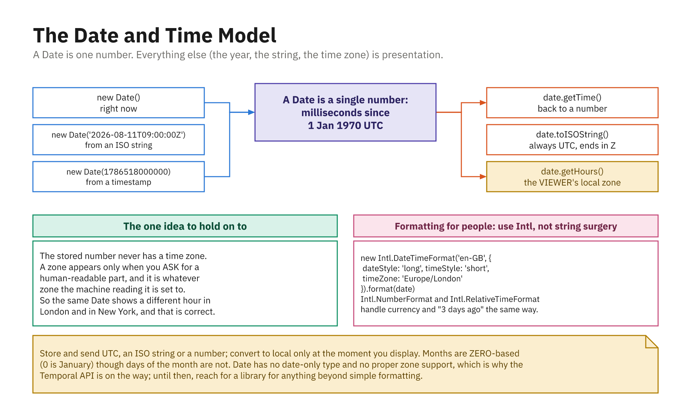

# Working with Dates and Times

The built-in `Date` object represents a single moment in time. It is one of the older, quirkier parts
of the language, so this chapter focuses on the pieces you will actually use and points out the traps.

Under the hood, every `Date` is really just **one number**: the count of milliseconds since the
**Unix epoch** (midnight UTC on January 1, 1970). Everything else (years, months, hours) is computed
from that number.



*A `Date` is one number: the year, the string, and the time zone are all presentation.*

---

## Creating dates

`Date` is a constructor, so you create instances with `new`.

```js
let now = new Date(); // the current date and time

// From a timestamp (milliseconds since 1970):
let epoch = new Date(0);            // Jan 1, 1970 UTC
let later = new Date(1783382400000);

// From individual parts - WATCH THE MONTH:
let birthday = new Date(2026, 6, 7); // July 7, 2026 - month 6 = July!

// From an ISO date string (recommended, unambiguous):
let fromString = new Date("2026-07-07"); // July 7, 2026 (UTC midnight)
let withTime = new Date("2026-07-07T14:30:00");
```

> **The month is zero-based.** January is `0`, December is `11`. This is the single most common `Date`
> mistake: `new Date(2026, 7, 7)` is *August* 7, not July 7. Days of the month, by contrast, start at
> `1` as you would expect.

---

## Timestamps

A timestamp is that underlying millisecond number. Two ways to get one:

```js
Date.now();          // 1783382400000 - current time, no object needed
new Date().getTime(); // same value from an instance
+new Date();          // same value (unary + coerces to the number)
```

Timestamps are the easiest way to **measure elapsed time** and to compare or subtract dates:

```js
let start = Date.now();
// ... do some work ...
let elapsedMs = Date.now() - start;
console.log(`Took ${elapsedMs} ms`);
```

---

## Reading the parts of a date

The `get*` methods pull out components in **local time**:

```js
let d = new Date("2026-07-07T14:30:15");

d.getFullYear(); // 2026
d.getMonth();    // 6      (July - zero-based, remember!)
d.getDate();     // 7      (day of the month, 1-based)
d.getDay();      // 2      (day of the WEEK: 0 = Sunday, 2 = Tuesday)
d.getHours();    // 14
d.getMinutes();  // 30
d.getSeconds();  // 15
```

Note the easy mix-up: `getDate()` is the day of the **month**; `getDay()` is the day of the **week**.

There are matching `getUTC*` methods (`getUTCHours`, etc.) that read the same moment in UTC instead of
local time.

---

## Changing the parts of a date

The `set*` methods **mutate** the date in place:

```js
let d = new Date("2026-07-07");
d.setFullYear(2027);
d.setMonth(11);   // December
d.setDate(25);
// d is now Dec 25, 2027
```

`Date` objects are mutable, so if you need to keep the original, copy it first:

```js
let original = new Date("2026-07-07");
let copy = new Date(original); // an independent clone
copy.setDate(14);              // original is untouched
```

---

## Formatting dates for people

The raw `Date` prints in an unfriendly form. Use the `toLocale*` methods, which respect the user's
language and region:

```js
let d = new Date("2026-07-07T14:30:00");

d.toLocaleDateString(); // "7/7/2026"   (format depends on the locale)
d.toLocaleTimeString(); // "2:30:00 PM"
d.toLocaleString();     // "7/7/2026, 2:30:00 PM" (date + time)
```

You can request a specific locale and control exactly which parts appear:

```js
d.toLocaleDateString("en-US", {
  weekday: "long",
  year: "numeric",
  month: "long",
  day: "numeric",
}); // "Tuesday, July 7, 2026"

d.toLocaleDateString("en-GB"); // "07/07/2026" (day-first in the UK)
```

### `Intl.DateTimeFormat`

When you will format many dates the same way, build a **reusable formatter** with
`Intl.DateTimeFormat`. It is the same engine `toLocaleString` uses, but you create it once:

```js
const formatter = new Intl.DateTimeFormat("en-US", {
  dateStyle: "medium",
  timeStyle: "short",
});

formatter.format(new Date("2026-07-07T14:30:00")); // "Jul 7, 2026, 2:30 PM"
formatter.format(new Date("2026-12-25T09:00:00")); // "Dec 25, 2026, 9:00 AM"
```

`Intl` also formats relative times ("3 days ago") via `Intl.RelativeTimeFormat`.

---

## Date math and differences

Because a date is a number of milliseconds, subtracting two dates gives the gap in milliseconds. Scale
it to the unit you want.

```js
let start = new Date("2026-07-01");
let end = new Date("2026-07-07");

let diffMs = end - start;                        // 518400000
let diffDays = diffMs / (1000 * 60 * 60 * 24);   // 6
```

The multipliers, from milliseconds up: `1000` ms in a second, `60` seconds in a minute, `60` minutes
in an hour, `24` hours in a day.

To add time, work through the timestamp or use a `set*` method:

```js
// 7 days from now:
let weekLater = new Date();
weekLater.setDate(weekLater.getDate() + 7); // handles month/year rollover automatically
```

> For heavy date arithmetic (parsing many formats, time zones, business-day math), most teams reach
> for a library such as **date-fns** or **Luxon** rather than hand-rolling it. The language is also
> gaining a modern replacement, the **Temporal** API, which fixes many `Date` quirks. It is finished
> at TC39 and expected in **ES2027**, but it is not in Node yet and not in every browser, so it needs
> a polyfill today. Watch for it as support matures.

---

## A note on ISO strings

The **ISO 8601** format (`YYYY-MM-DDTHH:mm:ss.sssZ`) is the safe, unambiguous way to store and
transmit dates, and it is exactly what `JSON.stringify` produces and what APIs expect.

```js
let d = new Date("2026-07-07T14:30:00Z");

d.toISOString(); // "2026-07-07T14:30:00.000Z"  - always UTC, the trailing Z means "Zulu"/UTC
```

Two rules of thumb:

- **Store and send** dates as ISO strings (or raw timestamps). They sort correctly as text and carry
  no locale ambiguity.
- **Format for display** only at the last moment, with `toLocale*` or `Intl`, in the user's locale.

And remember the ambiguity trap: `"2026-07-07"` (date only) is parsed as **UTC** midnight, while
`"2026-07-07T00:00:00"` (with a time, no `Z`) is parsed as **local** time. Include the `Z` or an
offset when you mean UTC.

---

## Summary

* A `Date` is a single number: **milliseconds since Jan 1, 1970 UTC**. Create with `new Date(...)`.
* **Months are zero-based** (`0` = January); `getDate()` is day-of-month, `getDay()` is day-of-week.
* `Date.now()` and `getTime()` give timestamps, ideal for measuring elapsed time and comparing dates.
* `get*`/`set*` read and mutate components; `Date` objects are mutable, so clone with `new Date(d)`
  before changing.
* Format for humans with `toLocaleDateString`/`toLocaleString` or a reusable `Intl.DateTimeFormat`.
* Subtract dates to get a difference in milliseconds, then scale by `1000 * 60 * 60 * 24` for days.
* Store and transmit as **ISO 8601** strings (`toISOString`); a date-only string parses as UTC, a
  date-time without `Z` parses as local.
* For complex work, reach for **date-fns**/**Luxon** or the upcoming **Temporal** API.
