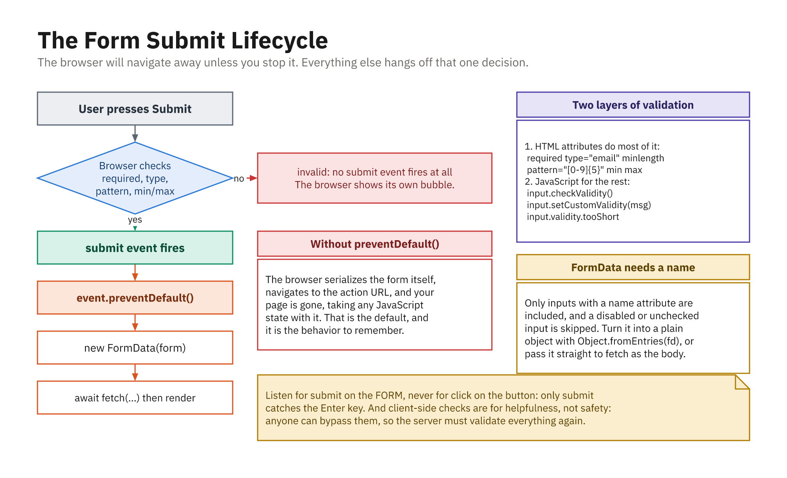

# Working with Forms in JavaScript

Forms are how the web collects information from people: sign-up pages, search boxes, checkout screens,
and settings panels are all forms. On their own, HTML forms already work: they gather input and send
it to a server when submitted. But most modern apps want to step in *before* that happens: to read the
values, check them, maybe transform them, and often send them with `fetch` instead of a full page
reload. That "stepping in" is what this chapter is about.

We will look at how to reach the fields in a form, read their values, respond to the **submit** event,
stop the browser's default submission with `event.preventDefault()`, and reset a form when we are done.



*The browser will navigate away unless you stop it; everything else hangs off that decision.*

---

## A form to work with

Every example below uses this small sign-up form. Notice that each field has a `name` attribute; the
`name` is the key JavaScript (and the server) uses to identify a field.

```html
<form id="signup">
  <input type="text" name="username" placeholder="Username">
  <input type="email" name="email" placeholder="Email">
  <input type="password" name="password" placeholder="Password">

  <label><input type="checkbox" name="newsletter"> Subscribe to newsletter</label>

  <fieldset>
    <label><input type="radio" name="plan" value="free" checked> Free</label>
    <label><input type="radio" name="plan" value="pro"> Pro</label>
  </fieldset>

  <select name="country">
    <option value="us">United States</option>
    <option value="ca">Canada</option>
    <option value="uk">United Kingdom</option>
  </select>

  <button type="submit">Create account</button>
</form>
```

---

## Reaching the form and its fields

You can grab the form like any other element:

```js
const form = document.getElementById("signup");
```

Once you have the form, its `elements` collection is the easiest way to reach the fields by their
`name`. This is cleaner than a separate `querySelector` for every input.

```js
const username = form.elements["username"];
const email = form.elements["email"];

console.log(username.name);  // "username"
console.log(username.tagName); // "INPUT"
```

You can also select fields the usual way if you prefer:

```js
const emailField = form.querySelector('input[name="email"]');
```

---

## Reading field values

Different kinds of fields expose their data through different properties. This is the part people most
often get wrong, so it is worth going one field type at a time.

### Text, email, password, and `<textarea>`

These all use the `.value` property, which is always a **string**, even for `type="number"`.

```js
const username = form.elements["username"].value;
console.log(username);        // "ada"
console.log(typeof username); // "string"
```

Because it is always a string, trim whitespace and convert to a number yourself when you need to:

```js
const age = Number(form.elements["age"].value); // "42" -> 42
const name = form.elements["username"].value.trim();
```

### Checkboxes: use `.checked`, not `.value`

A checkbox's `.value` never changes as the user clicks it. What changes is the boolean `.checked`.

```js
const wantsNewsletter = form.elements["newsletter"].checked;
console.log(wantsNewsletter); // true or false
```

### Radio buttons: read the group's value

Radio buttons share one `name`. When you ask the group for its `.value`, you get the value of the
currently selected button, which is exactly what you want.

```js
const plan = form.elements["plan"].value;
console.log(plan); // "free" or "pro"
```

### Select menus: `.value` and `selectedOptions`

For a single-select menu, `.value` gives the chosen option's value:

```js
const country = form.elements["country"].value;
console.log(country); // "ca"
```

For a **multiple**-select menu (`<select multiple>`), a single `.value` is not enough; read the
`selectedOptions` collection instead and map it to an array:

```js
const chosen = [...form.elements["skills"].selectedOptions].map(o => o.value);
console.log(chosen); // ["js", "css"]
```

---

## Setting field values

Reading and writing use the same properties, so you can pre-fill or change fields from code:

```js
form.elements["username"].value = "grace";   // fill a text field
form.elements["newsletter"].checked = true;   // tick a checkbox
form.elements["country"].value = "uk";        // pick a <select> option
```

Setting `.value` on a text field replaces whatever the user typed, which is handy for formatting input
(for example, uppercasing a coupon code) after they finish typing.

---

## The `submit` event and `event.preventDefault()`

When someone clicks a submit button (or presses Enter in a field), the form fires a **`submit`** event.
By default the browser then reloads the page and sends the data to the URL in the form's `action`
attribute. For a JavaScript-driven app, that reload is almost never what you want, because it throws
away your page state.

`event.preventDefault()` cancels the default behavior so your code can handle the data instead.

```js
form.addEventListener("submit", (event) => {
  event.preventDefault(); // stop the browser from reloading and submitting

  const username = form.elements["username"].value.trim();
  const email = form.elements["email"].value.trim();

  console.log("Creating account for:", username, email);
  // ...here you would validate, then send the data with fetch
});
```

Listen for `submit` on the **form**, not `click` on the button. The `submit` event also fires when the
user presses Enter inside a field, so listening on the form catches every way a form can be submitted.

---

## Submitting a form from JavaScript

Sometimes you want *your code* to submit the form, after a confirmation dialog, say, or when the
user picks an option that should immediately apply. There are two methods, and the difference between
them causes real bugs.

```js
form.requestSubmit();  // behaves exactly like clicking the submit button
form.submit();         // submits immediately, skipping everything
```

**`requestSubmit()` is almost always the one you want.** It does what a real click does: it runs the
browser's built-in validation, and it **fires the `submit` event**, so your own handler, with its
`preventDefault()` and its checks, still runs.

**`form.submit()` skips both.** It does not validate, and it does not fire the `submit` event. Any
logic you put in that handler is silently bypassed:

```js
form.addEventListener("submit", (event) => {
  event.preventDefault();
  console.log("This never runs for form.submit()");
});

form.submit();        // page navigates; the handler above is skipped entirely
form.requestSubmit(); // handler runs, preventDefault works
```

That silent bypass is the trap: someone adds validation to the `submit` handler months later and
cannot work out why it never fires. Prefer `requestSubmit()`, and treat `form.submit()` as a
deliberate "submit without any of my own logic" escape hatch.

You can also nominate which button is submitting, which matters when buttons carry different
`formaction` or `name`/`value` pairs the server reads:

```js
form.requestSubmit(form.elements["saveDraft"]);
```

---

## Resetting a form

After a successful submission you often want to clear the fields. Every form has a built-in
`reset()` method that restores all fields to their initial (HTML-defined) values.

```js
form.addEventListener("submit", (event) => {
  event.preventDefault();

  // ...process the data...

  form.reset(); // clear all fields back to their defaults
});
```

`reset()` restores the *default* values from the HTML, not empty strings, so a checkbox that started
`checked` becomes checked again, and a text input with a `value` attribute returns to that value. A
`reset` event fires too, if you ever need to react to it.

---

## Putting it together

Here is the whole flow: intercept the submit, read the fields, and reset when done.

```js
const form = document.getElementById("signup");

form.addEventListener("submit", (event) => {
  event.preventDefault();

  const data = {
    username: form.elements["username"].value.trim(),
    email: form.elements["email"].value.trim(),
    newsletter: form.elements["newsletter"].checked,
    plan: form.elements["plan"].value,
    country: form.elements["country"].value,
  };

  console.log(data);
  // { username: "ada", email: "ada@example.com",
  //   newsletter: true, plan: "pro", country: "ca" }

  form.reset();
});
```

This same pattern (prevent the default, read the fields, act on the data) underlies every form-driven
feature you will build. The next chapters add two important pieces: **validating** what the user typed,
and packaging it up with the **`FormData`** object to send to a server.

---

## Summary

* Grab a form with `document.getElementById`, then reach fields by `name` through `form.elements["..."]`.
* Read text/email/password/`textarea` with `.value` (always a **string**, so trim and convert as needed).
* Read checkboxes with `.checked`, radio groups with the group's `.value`, and multi-selects with
  `selectedOptions`.
* Setting those same properties writes values back into the form.
* Listen for the form's **`submit`** event and call `event.preventDefault()` to stop the page reload and
  handle the data in JavaScript.
* Use `form.reset()` to restore all fields to their initial values, typically after a successful submit.
