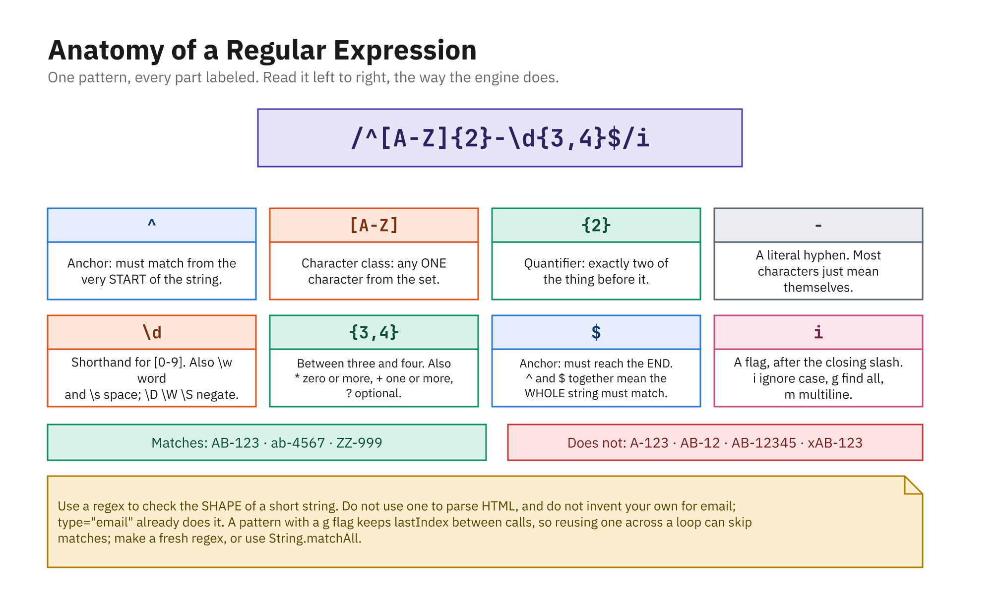

# Form Validation and Regular Expressions

Users make mistakes. They leave fields blank, type "gmail.com" without the `@`, enter a phone number
with letters in it, or pick a password like `1234`. **Validation** is the code that checks input before
you trust it, catching those mistakes early and telling the user how to fix them.

This chapter covers client-side validation with JavaScript and introduces **regular expressions**
(regex), a compact language for describing text patterns. Regex is the standard tool for questions like
"does this *look like* an email address?" or "is this exactly five digits?".

> **Client-side validation is for user experience, not security.** It gives instant feedback, but a
> determined user can bypass anything running in the browser. Always validate again on the server before
> saving or acting on data.



*One pattern, every part labeled: read it left to right, the way the engine does.*

---

## Validating without regex first

Not every check needs a pattern. Plenty of rules are just plain JavaScript.

```js
const username = form.elements["username"].value.trim();

if (username === "") {
  console.log("Username is required.");
}

if (username.length < 3) {
  console.log("Username must be at least 3 characters.");
}
```

Numbers, ranges, and "do two fields match?" are also plain logic:

```js
const age = Number(form.elements["age"].value);
if (Number.isNaN(age) || age < 18) {
  console.log("You must be 18 or older.");
}

const password = form.elements["password"].value;
const confirm = form.elements["confirm"].value;
if (password !== confirm) {
  console.log("Passwords do not match.");
}
```

Reach for regex when the rule is about the **shape** of a string (its allowed characters and their
arrangement) rather than a simple comparison.

---

## What a regular expression is

A regular expression is a pattern that describes a set of strings. You use it to test whether a string
matches the pattern, or to pull matching pieces out of a string.

There are two ways to create one:

```js
// 1. Regex literal - between slashes. Preferred for fixed patterns.
const zip = /^\d{5}$/;

// 2. RegExp constructor - use when the pattern comes from a variable/string.
const word = "cat";
const dynamic = new RegExp(word, "i");
```

Both make a `RegExp` object. Use the literal form for patterns you write by hand; use the constructor
when you have to build the pattern from a string at runtime (note that in the string form you must
double each backslash: `"\\d{5}"`).

---

## `test()` and `match()`

The two methods you will use most:

- **`regex.test(string)`** returns a boolean, which is what validation usually needs.
- **`string.match(regex)`** returns the matched text (or `null`), useful for extracting values.

```js
const zip = /^\d{5}$/;

zip.test("90210");   // true
zip.test("9021");    // false (only 4 digits)
zip.test("90210-1"); // false (extra characters)
```

```js
const result = "Order #4821 shipped".match(/\d+/);
console.log(result[0]); // "4821"  (the first run of digits)
```

For validation, `test()` is almost always what you want.

---

## Reading the pattern syntax

Regex looks cryptic until you learn its small vocabulary. Here are the pieces that appear in almost
every real-world pattern.

**Anchors**, where the match must sit in the string:

- `^`: start of the string
- `$`: end of the string

Anchoring with `^...$` forces the *whole* string to match, not just part of it. For validation you
nearly always want both, or a valid substring inside garbage would pass.

**Character classes**, what a single character may be:

- `\d`: a digit `0-9` (and `\D` is "not a digit")
- `\w`: a word character, meaning a letter, digit, or underscore
- `\s`: whitespace (and `\S` is "not whitespace")
- `.`: any character except a newline
- `[a-z]`: any lowercase letter; `[A-Za-z0-9]`: any letter or digit
- `[^@]`: any character *except* `@` (a leading `^` inside brackets means "not")

**Quantifiers**, how many of the preceding item:

- `*`: zero or more
- `+`: one or more
- `?`: zero or one (optional)
- `{5}`: exactly five
- `{3,}`: three or more
- `{2,4}`: between two and four

**Groups and alternation:**

- `( ... )`: group items together
- `|`: "or", as in `(jpg|png|gif)`

Because characters like `.`, `+`, `?`, and `(` are special, escape them with a backslash when you mean
the literal character: `\.` matches a real dot.

---

## Flags

A flag after the closing slash changes how the pattern behaves. The two you will use most:

```js
/hello/i.test("HELLO");   // true  - "i" = case-insensitive
```

```js
const text = "cat bat cat";
text.match(/cat/g);       // ["cat", "cat"] - "g" = find all matches, not just the first
```

Other flags exist (`m` for multiline, `s` for "dot matches newlines", `u` for full Unicode), but `i`
and `g` cover the vast majority of validation work.

---

## Common validation patterns

These are the patterns you will reach for constantly. Treat them as pragmatic, not perfect, especially
for email, where the fully correct pattern is famously enormous.

**Email**, a practical, good-enough pattern:

```js
const email = /^[^\s@]+@[^\s@]+\.[^\s@]+$/;
// "something (no spaces/@) @ something . something"

email.test("ada@example.com");  // true
email.test("ada@example");      // false (no dot + domain)
email.test("ada @ex.com");      // false (spaces)
```

**US phone number**, accepting a few common shapes via optional pieces:

```js
const phone = /^\(?\d{3}\)?[-.\s]?\d{3}[-.\s]?\d{4}$/;

phone.test("(555) 123-4567"); // true
phone.test("555-123-4567");   // true
phone.test("5551234567");     // true
phone.test("555-1234");       // false (too few digits)
```

**US ZIP code**, five digits optionally followed by `-` and four more:

```js
const zip = /^\d{5}(-\d{4})?$/;

zip.test("90210");       // true
zip.test("90210-1234");  // true
zip.test("9021");        // false
```

**Password strength**, at least 8 characters with a lowercase letter, an uppercase letter, and a
digit. This uses *lookaheads* (`(?=...)`), which assert "somewhere ahead there is..." without consuming
characters:

```js
const strong = /^(?=.*[a-z])(?=.*[A-Z])(?=.*\d).{8,}$/;

strong.test("password");   // false (no uppercase, no digit)
strong.test("Password1");  // true
strong.test("Pass1");      // false (too short)
```

If a single regex feels unreadable, it is perfectly fine to split the rules into several plain checks
instead; clarity beats cleverness.

---

## Showing inline error messages

Validation is only helpful if the user sees the result. The friendly pattern is an empty error
container next to each field that you fill in when something is wrong and clear when it is fixed.

```html
<form id="signup" novalidate>
  <input type="email" name="email">
  <div class="error" id="email-error"></div>

  <input type="password" name="password">
  <div class="error" id="password-error"></div>

  <button type="submit">Sign up</button>
</form>
```

> **`novalidate` is doing real work here.** Without it, the browser's own validation runs first: it
> sees `type="email"`, decides the value is invalid, shows its own gray bubble, and **never fires the
> `submit` event**. Your handler would not run at all, and none of the code below would execute.
> `novalidate` switches the browser's UI off so your own messages can take over. The next section
> shows the other option: keeping the browser's checks and reading their results yourself.

```css
.error { color: #c0392b; font-size: 0.875rem; min-height: 1.2em; }
input.invalid { border: 2px solid #c0392b; }
```

Two small helpers keep the code tidy:

```js
function showError(field, message) {
  document.getElementById(field + "-error").textContent = message;
  form.elements[field].classList.add("invalid");
}

function clearError(field) {
  document.getElementById(field + "-error").textContent = "";
  form.elements[field].classList.remove("invalid");
}
```

### Making the errors reachable for everyone

The markup above works if you can see it. For someone using a screen reader it currently announces
nothing: the red border is invisible to them, and the message appears in a `<div>` that has no stated
relationship to the input. They tab to the field, hear "email, edit text", and are told nothing is
wrong.

Four small additions fix it, and none of them change how the form looks:

```html
<form id="signup" novalidate>
  <label for="email">Email address</label>
  <input type="email" name="email" id="email" aria-describedby="email-error">
  <div class="error" id="email-error" role="alert"></div>
  ...
</form>
```

* **`<label for="...">`** tied to the input's `id` is the single most important one. It gives the field
  a name when focused, and it makes the label text a click target that focuses the input.
* **`aria-describedby`** points the input at its error container, so the message is read out *as part
  of the field* rather than as loose text somewhere on the page.
* **`role="alert"`** makes the container a live region: when you put text into it, assistive technology
  announces it immediately, without the user having to go looking.
* **`aria-invalid`** marks the field itself as failing, which is what your `.invalid` class is already
  doing visually. Set it in the same helper:

```js
function showError(field, message) {
  const input = form.elements[field];
  document.getElementById(field + "-error").textContent = message;
  input.classList.add("invalid");
  input.setAttribute("aria-invalid", "true");   // announced, not just colored
}

function clearError(field) {
  const input = form.elements[field];
  document.getElementById(field + "-error").textContent = "";
  input.classList.remove("invalid");
  input.removeAttribute("aria-invalid");
}
```

Two habits worth forming alongside them:

* **Never signal state with color alone.** A red border is invisible to a screen reader *and* to a
  good share of sighted users, since roughly one man in twelve has some form of color-vision deficiency.
  The text message is what carries the meaning; the color is a bonus.
* **Move focus to the first invalid field** when a submit fails. Otherwise a keyboard user is left at
  the submit button with no idea where the problem is:

```js
const firstInvalid = form.querySelector("[aria-invalid='true']");
if (firstInvalid) firstInvalid.focus();
```

This is a small amount of code for a large difference, and it is the part of form work most often
skipped.

---

## Validating on submit

Run all the checks when the form is submitted, and only proceed if everything passes.

```js
const form = document.getElementById("signup");
const emailPattern = /^[^\s@]+@[^\s@]+\.[^\s@]+$/;
const strongPassword = /^(?=.*[a-z])(?=.*[A-Z])(?=.*\d).{8,}$/;

form.addEventListener("submit", (event) => {
  event.preventDefault();
  let valid = true;

  const email = form.elements["email"].value.trim();
  if (!emailPattern.test(email)) {
    showError("email", "Please enter a valid email address.");
    valid = false;
  } else {
    clearError("email");
  }

  const password = form.elements["password"].value;
  if (!strongPassword.test(password)) {
    showError("password", "At least 8 chars, with upper, lower, and a number.");
    valid = false;
  } else {
    clearError("password");
  }

  if (valid) {
    console.log("All good - submitting!");
    form.reset();
  }
});
```

The `valid` flag ensures we check *every* field (so the user sees all their errors at once) rather than
stopping at the first failure.

---

## Letting the browser do the work: the Constraint Validation API

Everything above hand-rolls the checks. The browser can do a lot of it for you, because HTML has
validation attributes built in, and JavaScript can read the results.

Put the rules in the markup:

```html
<form id="signup2">
  <input type="email" name="email" required>
  <input type="password" name="password"
         required minlength="8"
         pattern="(?=.*[a-z])(?=.*[A-Z])(?=.*\d).{8,}">
  <button type="submit">Sign up</button>
</form>
```

`required`, `minlength`/`maxlength`, `min`/`max`, `type`, and `pattern` are all enforced by the
browser. Each field then exposes what it thinks:

```js
const email = form2.elements["email"];

email.checkValidity();  // true / false
email.validity.valid;         // the same boolean
email.validity.valueMissing;  // true when `required` is unmet
email.validity.typeMismatch;  // true when type="email" doesn't match
email.validity.patternMismatch; // true when `pattern` fails
email.validationMessage;      // the browser's own message text
```

`form2.checkValidity()` reports on the whole form at once.

The useful middle ground is to keep the browser's rules but show **your own** messages. Use
`novalidate` to suppress the native bubbles, then read `validity` yourself:

```js
const form2 = document.getElementById("signup2");
form2.setAttribute("novalidate", "");

form2.addEventListener("submit", (event) => {
  event.preventDefault();

  for (const field of form2.elements) {
    if (!field.name) continue; // skip the button

    if (field.validity.valueMissing) {
      showError(field.name, "This field is required.");
    } else if (field.validity.typeMismatch) {
      showError(field.name, "That does not look like an email address.");
    } else if (field.validity.patternMismatch) {
      showError(field.name, "Needs upper, lower, and a number.");
    } else {
      clearError(field.name);
    }
  }

  if (form2.checkValidity()) {
    console.log("All good - submitting!");
  }
});
```

For a rule HTML cannot express ("these two passwords must match"), use `setCustomValidity`. A
non-empty string marks the field invalid; an empty string clears it:

```js
function checkMatch() {
  const a = form2.elements["password"];
  const b = form2.elements["confirm"];
  b.setCustomValidity(a.value === b.value ? "" : "Passwords do not match.");
}
```

**Which approach?** Use the attributes for the ordinary rules: they are shorter, they work before
your JavaScript loads, and they are announced to screen readers. Drop to regex and hand-written
checks for the rules HTML has no word for. Most real forms use both.

---

## Validating as the user types

Waiting until submit works, but real-time feedback feels better. Listen for the **`input`** event on a
field to re-check it on every keystroke.

```js
form.elements["email"].addEventListener("input", (event) => {
  const value = event.target.value.trim();
  if (emailPattern.test(value)) {
    clearError("email");
  } else {
    showError("email", "Please enter a valid email address.");
  }
});
```

A common, polite refinement is to validate on `input` only *after* the field has been touched once (so
you are not yelling at someone who has not finished typing), while still doing the full sweep on submit.

---

## Summary

* Client-side validation improves UX but is **not** security; always re-validate on the server.
* Simple rules (empty, length, ranges, matching fields) are plain JavaScript; use **regex** for
  string-shape rules.
* Create a regex with a `/literal/` or `new RegExp(...)`; check it with `regex.test(string)` and extract
  with `string.match(regex)`.
* Learn the core syntax: anchors `^ $`, classes `\d \w \s [...]`, quantifiers `* + ? {n}`, groups
  `( )`, alternation `|`, and flags like `i` and `g`.
* Keep handy patterns for email, phone, ZIP, and password strength, aiming for good-enough rather than perfect.
* Show inline errors by filling a per-field container and toggling an `invalid` CSS class; validate on
  **`submit`** (with a `valid` flag) and optionally live on the **`input`** event.
* Make the errors **reachable**: a `<label for>` on every field, `aria-describedby` pointing the input
  at its error container, `role="alert"` on that container, and `aria-invalid` on the field. Never
  signal state with color alone, and move focus to the first invalid field when a submit fails.
* Add **`novalidate`** to the form when you show your own messages; otherwise the browser's native
  validation blocks submission and your `submit` handler never runs.
* The **Constraint Validation API** lets the browser hold the rules (`required`, `minlength`,
  `pattern`) while you read the outcome (`checkValidity()`, `field.validity.*`,
  `field.validationMessage`) and supply cross-field rules with `setCustomValidity()`. Most real forms
  combine it with hand-written checks.
