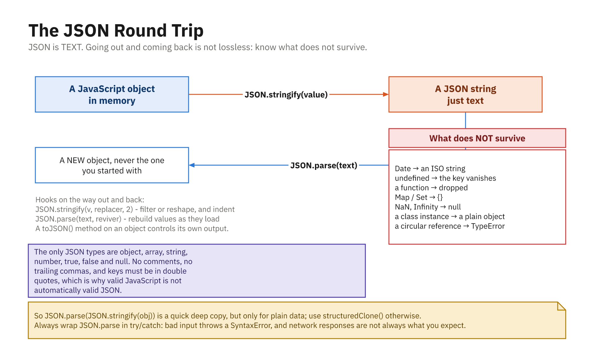

# JSON: Syntax and Serialization

**JSON** stands for **JavaScript Object Notation**. It is a lightweight, text-based format for storing and exchanging data. It was inspired by JavaScript object literals, but today it is a language-independent standard, and almost every programming language can read and write it.

You will run into JSON constantly: it is the format most web APIs speak, it is how many config files are written, and it is how the browser's `localStorage` stores structured data.

The key idea is **serialization**: turning an in-memory value (a JavaScript object) into a string you can save or send, and then **parsing** that string back into a value later.



*Object to text and back, but the trip is not lossless.*

---

## What JSON Looks Like

A JSON document is just text. Here is a small example describing a user:

```json
{
  "name": "Alice",
  "age": 30,
  "isAdmin": false,
  "roles": ["editor", "reviewer"],
  "address": {
    "city": "Seattle",
    "zip": "98101"
  },
  "manager": null
}
```

If that looks almost exactly like a JavaScript object, that is the point, but JSON has **stricter rules**, and it is text, not live code.

---

## JSON Syntax Rules

JSON supports a small, fixed set of value types:

- **string**: always double-quoted, as in `"hello"`
- **number**: `42`, `3.14`, `-7` (no `NaN`, no `Infinity`)
- **boolean**: `true` or `false`
- **null**: `null`
- **object**: `{ "key": value, ... }`
- **array**: `[ value, value, ... ]`

Objects and arrays can nest inside each other to any depth.

### The rules that trip people up

JSON is deliberately strict. All of these are **invalid** JSON:

```jsonc
{
  name: "Alice",           // keys must be in double quotes
  'city': 'Seattle',       // single quotes are not allowed
  "age": 30,               // trailing comma after the last item
  "greet": function () {}, // functions are not allowed
  "missing": undefined,    // undefined is not a JSON value
  // comments are not allowed either
}
```

The corrected version:

```json
{
  "name": "Alice",
  "city": "Seattle",
  "age": 30
}
```

Quick checklist for valid JSON:

- **Double quotes** around every key and every string value, never single quotes.
- **No trailing commas** after the last element in an object or array.
- **No comments** (`//` or `/* */`).
- **No functions, no `undefined`, no `NaN`, no `Infinity`**: those are JavaScript concepts, not JSON.
- No dates as a real type: dates are written as strings (more on this below).

---

## JSON vs XML

Before JSON became common, **XML** was the usual way to exchange structured data. XML still works, but JSON is more compact and maps directly onto the objects and arrays you already use in code.

Here is the same data in both formats.

**JSON:**

```json
{
  "user": {
    "name": "Alice",
    "age": 30,
    "roles": ["editor", "reviewer"]
  }
}
```

**XML:**

```xml
<user>
  <name>Alice</name>
  <age>30</age>
  <roles>
    <role>editor</role>
    <role>reviewer</role>
  </roles>
</user>
```

A few takeaways:

- JSON is **less verbose**, with no closing tags repeating every name.
- JSON has **native arrays**; XML has to invent a repeated-element convention.
- JSON parses **directly into objects/arrays** in JavaScript with one function call.
- XML is still strong where you need attributes, mixed text-and-markup, schemas, or namespaces, but for typical web APIs, JSON has become the default.

---

## `JSON.stringify`: Object to Text

`JSON.stringify(value)` serializes a JavaScript value into a JSON string.

```js
const user = { name: "Alice", age: 30, isAdmin: false };

const text = JSON.stringify(user);
console.log(text);
// {"name":"Alice","age":30,"isAdmin":false}

console.log(typeof text);
// "string"
```

### Pretty-printing with the `space` argument

The **third** argument adds indentation, making the output readable. Pass a number (spaces per level) or a string.

```js
const user = { name: "Alice", age: 30, roles: ["editor", "reviewer"] };

console.log(JSON.stringify(user, null, 2));
// {
//   "name": "Alice",
//   "age": 30,
//   "roles": [
//     "editor",
//     "reviewer"
//   ]
// }
```

Use the compact form for storing or sending data; use the pretty form for logs and files people read.

### Filtering with the `replacer` argument

The **second** argument controls *which* values get included. It can be an **array of key names** to keep:

```js
const user = { name: "Alice", age: 30, password: "s3cret" };

console.log(JSON.stringify(user, ["name", "age"]));
// {"name":"Alice","age":30}   (password omitted)
```

Or a **function** called for each key/value pair. Returning `undefined` drops that key:

```js
const user = { name: "Alice", age: 30, password: "s3cret" };

const safe = JSON.stringify(user, (key, value) => {
  if (key === "password") return undefined; // drop it
  return value;
});

console.log(safe);
// {"name":"Alice","age":30}
```

This is handy for stripping out sensitive or internal fields before sending data anywhere.

### Letting an object customize itself with `toJSON`

If a value has a `toJSON()` method, `JSON.stringify` calls it and serializes the result instead. This is exactly how `Date` works, and it returns an ISO string:

```js
const event = { title: "Launch", when: new Date("2026-07-07T15:00:00Z") };

console.log(JSON.stringify(event));
// {"title":"Launch","when":"2026-07-07T15:00:00.000Z"}
```

You can add your own `toJSON` to control how a class serializes:

```js
class Money {
  constructor(cents) { this.cents = cents; }
  toJSON() { return (this.cents / 100).toFixed(2); }
}

console.log(JSON.stringify({ price: new Money(1999) }));
// {"price":"19.99"}
```

---

## `JSON.parse`: Text to Object

`JSON.parse(text)` does the reverse: it turns a JSON string back into a JavaScript value.

```js
const text = '{"name":"Alice","age":30,"roles":["editor","reviewer"]}';

const user = JSON.parse(text);
console.log(user.name);       // "Alice"
console.log(user.roles[0]);   // "editor"
console.log(typeof user);     // "object"
```

If the text is not valid JSON, `JSON.parse` **throws**, so wrap it in `try/catch` when the input is untrusted:

```js
try {
  JSON.parse("{ not valid }");
} catch (error) {
  console.log("Could not parse:", error.message);
  // Could not parse: Expected property name or '}' in JSON at position 2 ...
}
```

### Transforming with the `reviver` argument

`JSON.parse` takes an optional second argument, a **reviver** function, called for every key/value pair as the object is rebuilt. Whatever it returns becomes the value.

The classic use is turning ISO date strings back into real `Date` objects (remember: JSON has no date type):

```js
const text = '{"title":"Launch","when":"2026-07-07T15:00:00.000Z"}';

const isoDate = /^\d{4}-\d{2}-\d{2}T/;

const event = JSON.parse(text, (key, value) => {
  if (typeof value === "string" && isoDate.test(value)) {
    return new Date(value);
  }
  return value;
});

console.log(event.when instanceof Date); // true
console.log(event.when.getFullYear());   // 2026
```

---

## Common Pitfalls

### Dates become strings

This is the big one. `JSON.stringify` turns a `Date` into a string, and `JSON.parse` does **not** turn it back: you get a string, not a `Date`.

```js
const original = { when: new Date("2026-07-07T15:00:00Z") };

const roundTripped = JSON.parse(JSON.stringify(original));

console.log(roundTripped.when instanceof Date); // false
console.log(typeof roundTripped.when);          // "string"
```

If you need real dates back, use a **reviver** (shown above).

### Circular references throw

If an object refers back to itself, `JSON.stringify` cannot represent it and throws:

```js
const node = { name: "A" };
node.self = node; // points at itself

JSON.stringify(node);
// TypeError: Converting circular structure to JSON
```

Break the cycle (or use a replacer to skip the offending key) before serializing.

### Values that silently disappear

`undefined`, functions, and symbols are **omitted** from objects (and become `null` inside arrays):

```js
console.log(JSON.stringify({ a: undefined, b: () => {}, c: 1 }));
// {"c":1}    (a and b vanished)

console.log(JSON.stringify([undefined, function () {}, 1]));
// [null,null,1]
```

JSON has no representation for any of these, so do not rely on it to carry them.

---

## Where JSON Is Used

- **Web APIs.** Most REST APIs send and receive JSON. In the browser, `fetch` gives you a `response.json()` helper that parses the body for you.
- **Configuration files.** `package.json`, `tsconfig.json`, and many tool configs are JSON.
- **Browser storage.** `localStorage` and `sessionStorage` only hold strings, so you `JSON.stringify` on the way in and `JSON.parse` on the way out:

```js
const settings = { theme: "dark", fontSize: 16 };

localStorage.setItem("settings", JSON.stringify(settings));

const saved = JSON.parse(localStorage.getItem("settings"));
console.log(saved.theme); // "dark"
```

---

## Summary

- **JSON** is a text format for structured data: objects, arrays, strings, numbers, booleans, and `null`.
- Syntax is strict: **double quotes** on all keys/strings, **no trailing commas**, **no comments, functions, or `undefined`**.
- Compared to **XML**, JSON is more compact, has native arrays, and maps straight onto JavaScript objects.
- **`JSON.stringify(value, replacer, space)`** serializes to text; `replacer` filters keys and `space` pretty-prints. A `toJSON()` method lets a value customize its own output.
- **`JSON.parse(text, reviver)`** parses text back into a value; a `reviver` can transform values, e.g. revive ISO strings into `Date` objects.
- Watch the pitfalls: **dates come back as strings**, **circular references throw**, and `undefined`/functions **silently disappear**.
- JSON powers **APIs, config files, and browser storage**, so you will use it every day.
