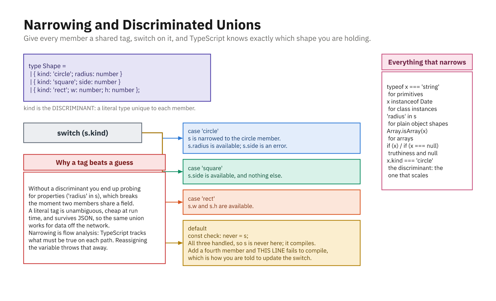

# Variable and Function Types

Now that you know *why* TypeScript exists, this chapter puts it to work. It covers the two most common places you attach types: **variables** and **functions**. Along the way we meet TypeScript's primitive types, its special types (`any`, `unknown`, `never`), arrays, tuples, unions, literals, and the feature that keeps TypeScript from feeling like extra typing, **type inference**.



*Switch on the tag; `never` at the bottom proves you covered every case.*

---

## Type Annotations on Variables

A **type annotation** is a colon and a type after a variable name. It tells TypeScript what kind of value the variable is allowed to hold.

```ts
let age: number = 30;
let firstName: string = "Ada";
let isAdmin: boolean = false;
```

Once annotated, the variable is locked to that type. Assigning the wrong type is an error:

```ts
age = "thirty";
// Error: Type 'string' is not assignable to type 'number'.
```

---

## Primitive Types

TypeScript has a type for each JavaScript primitive. Note the type names are **lowercase**.

```ts
let count: number = 42;        // all numbers (ints and floats) are `number`
let title: string = "Hello";
let done: boolean = true;
let nothing: null = null;
let missing: undefined = undefined;
let big: bigint = 100n;        // arbitrarily large integers
let key: symbol = Symbol("id");
```

There is no separate integer/float type; every number is `number`.

---

## `any`, `unknown`, and `never`

TypeScript adds three special types that do not exist in JavaScript. Knowing when to use each is a hallmark of good TypeScript.

### `any`: the escape hatch (avoid it)

A value typed `any` opts **out** of type checking entirely. Anything goes, which defeats the purpose of TypeScript:

```ts
let data: any = 5;
data = "now a string";  // OK
data.foo.bar.baz;       // no error - but will crash at runtime
```

Use `any` only as a last resort. Reaching for it too often turns TypeScript back into JavaScript.

### `unknown`: the safe alternative

`unknown` also holds any value, but TypeScript **forces you to check** the type before using it. It is the type-safe version of `any`:

```ts
let input: unknown = fetchSomething();

input.toUpperCase();
// Error: 'input' is of type 'unknown'.

if (typeof input === "string") {
  input.toUpperCase(); // OK - TypeScript now knows it's a string
}
```

Prefer `unknown` over `any` whenever you truly don't know a value's type up front.

### `never`: the type that never happens

`never` represents a value that can never occur, for example a function that always throws or never returns:

```ts
function fail(message: string): never {
  throw new Error(message); // never returns normally
}
```

You will not annotate `never` often, but you will see it in error messages and exhaustiveness checks.

---

## Arrays and Tuples

An **array** type is the element type followed by `[]`:

```ts
let scores: number[] = [90, 85, 100];
let names: string[] = ["Ada", "Alan"];

scores.push(95);       // OK
scores.push("hello");  // Error: 'string' is not assignable to 'number'.
```

An alternative, equivalent syntax uses the generic form `Array<T>`:

```ts
let scores: Array<number> = [90, 85, 100];
```

A **tuple** is a fixed-length array where each position has its own type. Useful for a pair or a small record of related values:

```ts
let point: [number, number] = [10, 20];
let entry: [string, number] = ["age", 30];

entry[0].toUpperCase(); // OK - position 0 is a string
entry[1].toFixed(2);    // OK - position 1 is a number
```

---

## Union and Literal Types

A **union type** (`|`) means "one of these types." It is one of TypeScript's most-used features:

```ts
let id: number | string;
id = 101;      // OK
id = "A-101";  // OK
id = true;     // Error: 'boolean' is not assignable to 'number | string'.
```

A **literal type** narrows a value to *specific* allowed values, not just a whole type. Combined with unions, this models a fixed set of options:

```ts
let direction: "up" | "down" | "left" | "right";
direction = "up";     // OK
direction = "north";  // Error: not one of the allowed literals.
```

This is TypeScript's lightweight answer to enumerations, an exact, self-documenting set of valid values.

---

## Narrowing (Type Guards)

When a value is a union, TypeScript won't let you use a member that exists on only *some* of its types
until you **narrow** it: prove which type you actually have. Inside a check, TypeScript automatically
refines the type (this is **narrowing**), and the checks that trigger it are **type guards**.

```ts
function format(id: number | string) {
  if (typeof id === "string") {
    return id.toUpperCase(); // here TypeScript knows `id` is a string
  }
  return id.toFixed(0);      // here it must be a number
}
```

The everyday type guards:

- **`typeof`**: narrow primitives (`"string"`, `"number"`, `"boolean"`, ...).
- **`instanceof`**: narrow to a class instance (`if (err instanceof Error)`).
- **`in`**: narrow object shapes by whether a property exists.
- **A truthiness check**: narrows away `null` / `undefined` (`if (user) { ... }`).

```ts
function area(shape: { radius: number } | { side: number }) {
  if ("radius" in shape) return Math.PI * shape.radius ** 2;
  return shape.side ** 2;
}
```

Narrowing is what makes union types safe: check first, and TypeScript guarantees the members you touch
actually exist on the narrowed type.

---

## Type Inference

Here is the feature that makes TypeScript pleasant: you usually **don't** need to write annotations. TypeScript **infers** the type from the value you assign.

```ts
let city = "Boston"; // inferred as string
city = 42;           // Error: 'number' is not assignable to 'string'.

let total = 0;       // inferred as number
const PI = 3.14159;  // inferred as the literal 3.14159 (const can't change)
```

Because inference is so good, the common style is: **let TypeScript infer local variables**, and **add annotations where they add clarity or aren't obvious**, especially function parameters and public boundaries. Annotating `let city: string = "Boston"` is redundant; the inference already knows.

---

## Typing Function Parameters and Return Types

Functions are where annotations earn their keep: TypeScript cannot guess what callers will pass in, so you tell it. Annotate each **parameter**, and optionally the **return type**:

```ts
function add(a: number, b: number): number {
  return a + b;
}

add(2, 3);       // 5
add(2, "3");     // Error: 'string' is not assignable to 'number'.
```

The return type (`: number` above) is often **inferred**, so you can omit it, but writing it explicitly documents intent and catches mistakes inside the function body:

```ts
function greet(name: string): string {
  return `Hi, ${name}`; // if you accidentally returned a number, TS would flag it here
}
```

Arrow functions work the same way:

```ts
const multiply = (a: number, b: number): number => a * b;
```

---

## Optional and Default Parameters

Mark a parameter **optional** with `?`. An omitted optional parameter is `undefined`, so its type is really `type | undefined`:

```ts
function greet(name: string, title?: string): string {
  if (title) {
    return `Hello, ${title} ${name}`;
  }
  return `Hello, ${name}`;
}

greet("Ada");            // "Hello, Ada"
greet("Ada", "Dr.");     // "Hello, Dr. Ada"
```

A **default parameter** supplies a fallback value and makes the parameter optional automatically. TypeScript infers the type from the default:

```ts
function increment(value: number, step = 1): number {
  return value + step;
}

increment(10);    // 11
increment(10, 5); // 15
```

Optional parameters (`?`) must come **after** all required parameters.

---

## The `void` Return Type

A function that returns nothing has the return type **`void`**. This is common for functions that only produce a side effect, like logging:

```ts
function logMessage(message: string): void {
  console.log(message);
  // no return statement - returns undefined, typed as void
}
```

`void` signals to callers "don't expect a useful value back." It differs from `never`: a `void` function *finishes* (returning nothing), while a `never` function *never finishes* (it throws or loops forever).

---

## Summary

* A **type annotation** (`name: type`) constrains what a variable can hold; the wrong type is a compile error.
* **Primitive types** are lowercase: `number`, `string`, `boolean`, `null`, `undefined`, `bigint`, `symbol`.
* **`any`** disables checking (avoid it); **`unknown`** is the safe version that forces a check first; **`never`** is a value that can't happen.
* **Arrays** are `type[]` (or `Array<type>`); **tuples** are fixed-length arrays with a type per position.
* **Union types** (`A | B`) allow one of several types; **literal types** (`"up" | "down"`) allow specific exact values.
* **Type inference** means you rarely annotate obvious locals; let TypeScript figure them out, and annotate function parameters and boundaries.
* Type function **parameters** and optionally **return types**; use **`?`** for optional params, a **default value** for optional-with-fallback, and **`void`** for functions that return nothing.
