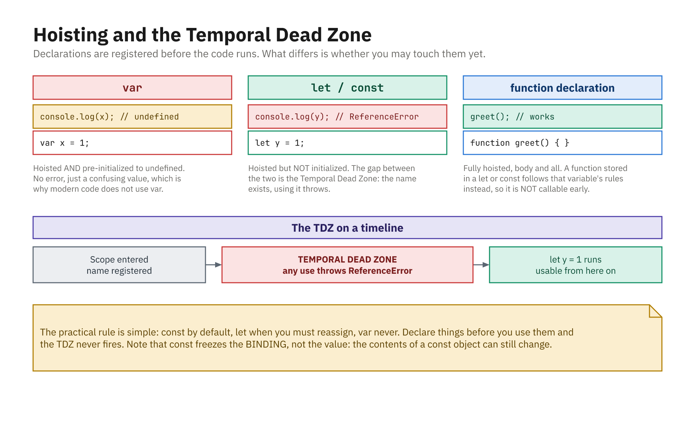
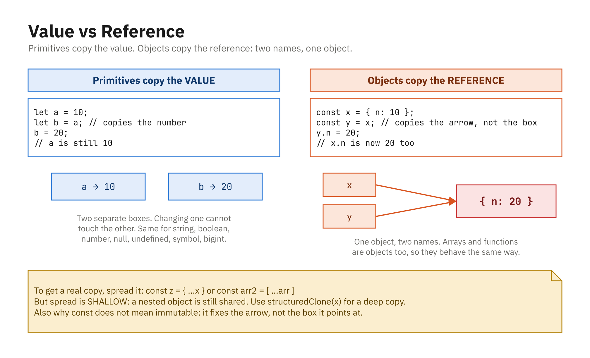

## JavaScript in One Minute

- Programming language of the web, created in **1995** by Brendan Eich
- **Not** related to Java; the name was a marketing choice
- Runs almost everywhere: browsers, servers, phones, tiny devices
- If you know variables, functions, and loops, much will look familiar
- This course teaches its **current, modern form**

## ECMAScript: The Standard

- **ECMAScript (ES)** is the written *specification*, the rulebook
- **JavaScript** is the language you actually *write*, an implementation
- Maintained by the **TC39** committee, which ships one edition per year
- **ES2015 (ES6)** was the big modernizing release, the baseline here
- **ES2017:** `async`/`await` · **ES2020:** optional chaining `?.`, nullish `??`
- **ES2022:** `Object.hasOwn`, top-level `await`, class fields
- **ES2025:** iterator helpers, new `Set` methods, `RegExp.escape`
- **ES2026 (current):** `Error.isError`, `Math.sumPrecise`, `Array.fromAsync`
- Everyday usage: say "JavaScript" for the language, "ES2020" for a version

## Where JavaScript Runs

- **In the browser**: change the page (DOM), respond to events, `fetch` data
- Browser-only globals: `window`, `document`, `fetch`
- **On the server with Node.js**: the same language, outside the browser
- Node extras: file system, network, but **no** `document` or `window`
- An **engine** actually runs your code, and comes bundled, never installed alone
- **V8** (Chrome, Edge, Node) · **SpiderMonkey** (Firefox) · **JavaScriptCore** (Safari)

## ES2015 Modernized the Language

```js
let count = 0;            // block-scoped variables
const name = "Ada";       // constants
const greet = () => {};   // arrow functions
const msg = `Hi ${name}`; // template literals
const [a, b] = [1, 2];    // destructuring
```

- Baseline for this course is **ES2015+**
- Older code you meet in the wild will look different; we will note where

## Dynamic and Loosely Typed

- **Dynamic**: types are checked at **runtime**, not ahead of time
- **Loosely typed**: JS often **converts** types for you (coercion)
- The **value** has a type, not the variable

```js
let x = 10;    // x is a number
x = "hello";   // now x is a string
x = false;     // now x is a boolean
```

## Primitive Types vs Objects

- Primitives: `number`, `string`, `boolean`, `undefined`, `null`, `symbol`, `bigint`
- Everything else is an **object** (arrays, functions, plain objects)

```js
let age = 30;                 // number (primitive)
let name = "Alice";           // string (primitive)
let nothing = null;           // null (primitive)
let notSet;                   // undefined (primitive)
let user = { name: "Alice" }; // object
let numbers = [1, 2, 3];      // object (array)
```

## The `typeof` Operator

```js
typeof 42;             // "number"
typeof "hello";        // "string"
typeof true;           // "boolean"
typeof undefined;      // "undefined"
typeof { a: 1 };       // "object"
typeof [1, 2, 3];      // "object" (arrays are objects)
typeof function () {}; // "function"
typeof null;           // "object" (a long-standing bug)
```

- For `null`, check `value === null` instead of using `typeof`

## Declaring: `let`, `const`, `var`

- **`let`**: for values that can **change**
- **`const`**: for values that should **not be reassigned**
- **`var`**: the old way; tricky scope, avoid in new code

```js
let score = 0;
score = 10;      // OK

const pi = 3.14;
// pi = 3.14159; // Error: Assignment to constant variable
```

- A `const` **must** be given a value when declared

## `const` Protects the Binding, Not the Value

```js
const settings = { theme: "dark" };

settings.theme = "light"; // OK - the object changed
// settings = {};         // Error - the binding cannot be reassigned

const list = [1, 2];
list.push(3);             // OK - [1, 2, 3]
```

- `const` means "this name always points at this value"
- It does **not** freeze the object; use `Object.freeze` for that

## Declaring vs Initializing, and Naming



- Declared but not yet initialized: `let` and `const` are in the **TDZ**
- Names start with a letter, `_` or `$`; never a reserved word

## Scope: Where a Variable Exists

- A **block** is anything inside `{ }` (as in `if` or `for`)
- `let`/`const` are **block-scoped**: they exist only inside the block

```js
if (true) {
  let message = "Hello";
  console.log(message); // "Hello"
}
console.log(message); // Error: message is not defined
```

## `var` Is Function-Scoped

```js
if (true) {
  var test = "I escape the block";
}
console.log(test); // "I escape the block"

if (true) {
  let test2 = "Block only";
}
console.log(test2); // Error: test2 is not defined
```

- `var` is function-scoped, hoisted, and confusing; prefer `let`/`const`

## Assignment Evaluates the Right Side First

```js
let a = 2;
let b = 1 + 2;  // evaluate 1 + 2, then store 3

let c = a;      // a evaluates to 2, so 2 is stored in c
let d = a + 2;  // 4

a = 5;          // reassign a

console.log(c); // 2 - c copied the VALUE, not the variable
console.log(a); // 5
```

## Value Types vs Reference Types



- Primitives copy the **value**; objects copy the **reference**
- Two names, one object; changing either changes both
