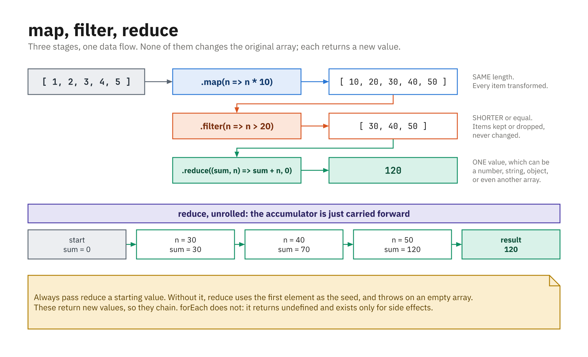

## `forEach` and `map`

- `forEach` runs a function per item (no new array)
- `map` builds a **new** array of transformed values

```js
const nums = [1, 2, 3];

nums.forEach((n, i) => console.log(i, n));

const doubled = nums.map((n) => n * 2);
console.log(doubled); // [2, 4, 6]
console.log(nums);    // [1, 2, 3] - unchanged
```

- `map` always returns an array the **same length** as the original

## `filter`

- Keeps only the items for which your function returns `true`
- Returns a **new**, usually shorter, array

```js
const ages = [15, 21, 18, 30];
const adults = ages.filter((age) => age >= 18);
console.log(adults); // [21, 18, 30]

const users = [
  { name: "Sam", age: 25 },
  { name: "Alex", age: 30 },
];
users.filter((u) => u.age > 27); // [{ name: "Alex", age: 30 }]
```

## `reduce`: Many Values to One

- `map`/`filter` return arrays; `reduce` returns **one value**
- Takes a function **and a starting value**; always pass the seed

```js
const prices = [10, 20, 30];

const total = prices.reduce((sum, price) => sum + price, 0);
//                           ^running ^current      ^start

console.log(total); // 60
// 0 + 10 = 10, 10 + 20 = 30, 30 + 30 = 60
```

## Always Pass the Seed

```js
[].reduce((a, b) => a + b, 0); // 0 - fine

// [].reduce((a, b) => a + b);
// TypeError: Reduce of empty array with no initial value
```

- Without a seed, `reduce` uses the **first item** as the starting value
- That breaks on an empty array, and changes the type of the result
- The seed also declares what you are building: `0`, `""`, `[]`, `{}`

## `reduce`: Building an Object

- The accumulator can be any type, not just a number
- Here it tallies how often each word appears

```js
const words = ["js", "css", "js"];

const counts = words.reduce((tally, word) => {
  tally[word] = (tally[word] || 0) + 1;
  return tally;
}, {});

console.log(counts); // { js: 2, css: 1 }
```

## `find`, `some`, and `every`

- `find` → the **first** match, or `undefined`
- `some`/`every` → a plain boolean

```js
const nums = [4, 9, 16, 25];

nums.find((n) => n > 10);  // 16
nums.find((n) => n > 100); // undefined

nums.some((n) => n > 20);  // true  - is ANY over 20?
nums.every((n) => n > 20); // false - are ALL over 20?
```

- Use `find` for one item, `filter` for a list

## Chaining Them Together

- Each returns an array, so they compose left to right

```js
const orders = [
  { item: "mug",    qty: 2, price: 12 },
  { item: "kettle", qty: 1, price: 40 },
  { item: "spoon",  qty: 8, price: 3 },
];

const bigTotal = orders
  .filter((o) => o.qty > 1)          // mug, spoon
  .map((o) => o.qty * o.price)       // [24, 24]
  .reduce((sum, n) => sum + n, 0);   // 48
```

## Choosing the Right One

| You want | Use |
|---|---|
| A new array, same length | `map` |
| A shorter array | `filter` |
| One value out of many | `reduce` |
| The first matching item | `find` |
| A yes/no answer | `some` / `every` |
| Just side effects | `forEach` |

- If you are `push`ing inside a `forEach`, you probably wanted `map` or `filter`

## The Pipeline, End to End



- Each stage returns a new value, which is why they chain
- `forEach` returns `undefined`, so it cannot
