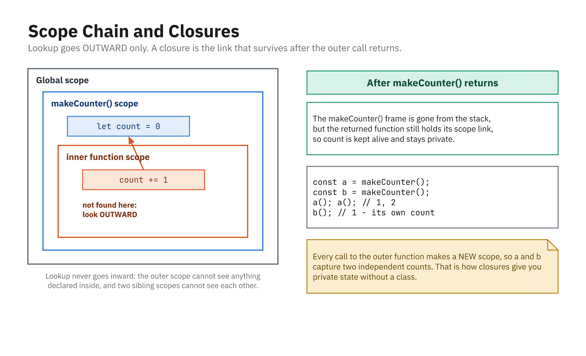

## What Is a Function?

- A reusable, named block of code
- Optional inputs, optional returned result
- Avoids repetition; organizes logic

```js
function greet() {
  console.log("Hello!");
}

greet(); // call (invoke) the function
```

## Parameters and Arguments

- **Parameters** are names in the definition
- **Arguments** are the values you pass
- Give parameters **default values** for missing args

```js
function greetUser(name = "guest") {
  console.log("Welcome, " + name + "!");
}

greetUser("Sam"); // "Welcome, Sam!"
greetUser();      // "Welcome, guest!"
```

- A missing argument is `undefined`; the default fills in for exactly that

## Return Values

- `return` sends a value back and **stops** the function
- No `return` means the result is `undefined`

```js
function add(a, b) {
  return a + b;
}

const result = add(3, 4);
console.log(result); // 7
```

- Everything after a `return` in that branch is dead code

## Function Expressions

- A function can be stored in a variable
- Useful for passing functions around

```js
const multiply = function (a, b) {
  return a * b;
};

console.log(multiply(2, 5)); // 10
```

## Arrow Functions

- Shorter syntax for function expressions
- A single expression can drop `{}` and `return`

```js
const divide = (a, b) => {
  return a / b;
};

const square = (n) => n * n;   // implicit return

console.log(divide(10, 2)); // 5
console.log(square(4));     // 16
```

## Declarations Hoist, Expressions Do Not

```js
sayHi();          // works - the whole function is hoisted
function sayHi() { console.log("hi"); }

sayBye();         // ReferenceError: Cannot access before initialization
const sayBye = () => console.log("bye");
```

- A **declaration** is available everywhere in its scope
- An **expression** only exists after the assignment line runs
- This is why "define before use" is a safe habit either way

## Rest Parameters

- `...` collects every remaining argument into a real array

```js
function sumAll(...numbers) {
  return numbers.reduce((total, n) => total + n, 0);
}

sumAll(1, 2, 3);       // 6
sumAll(10, 20, 30, 40); // 100
sumAll();               // 0
```

- Must be the **last** parameter
- Unlike the old `arguments` object, it is a genuine array

## Spreading Arguments

- The same `...` at a **call site** unpacks an array into arguments

```js
const prices = [5, 10, 15, 20];

sumAll(prices);      // "05,10,15,20"  - ONE argument, the array itself,
                     //   which `0 + [...]` quietly turns into a string
sumAll(...prices);   // 50 - four separate arguments

Math.max(...prices); // 20   (Math.max(prices) would be NaN)
```

- Rest **collects** in a definition; spread **expands** in a call
- Forgetting the `...` rarely errors; it just gives you nonsense

## The Scope Chain



- Lookup goes **outward only**, never inward
- A closure is the link that survives the outer call returning
