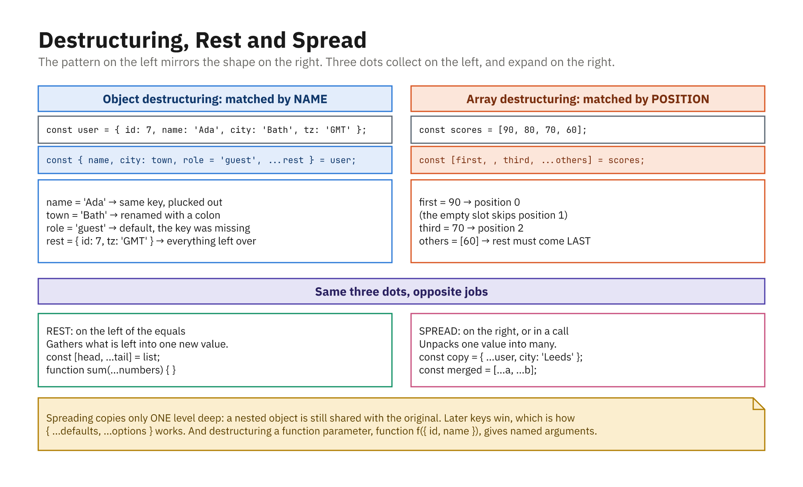

## Object Destructuring

- Extract properties into variables
- Rename with `:`, supply defaults with `=`

```js
const user = { name: "Sam", age: 25, isAdmin: false };

const { name, age } = user;
const { name: userName } = user;      // rename
const { role = "member" } = user;     // default

console.log(name, age, userName, role);
// "Sam" 25 "Sam" "member"
```

- Matches by **name**, so order does not matter

## Destructuring in Parameters

- Very common: pull fields straight from an argument object

```js
function greet({ name, age }) {
  console.log("Hello " + name + ", age " + age);
}

greet({ name: "Sam", age: 25 });
// "Hello Sam, age 25"
```

- The call site reads like named arguments, in any order
- Add defaults right there: `function greet({ name, age = 0 })`

## Array Destructuring

- Uses **position**, not property names
- Skip items with commas; defaults with `=`

```js
const colors = ["red", "green", "blue"];

const [first, second] = colors;   // "red", "green"
const [primary, , tertiary] = colors; // skip green

let x = 1, y = 2;
[x, y] = [y, x];                  // swap → 2 1
```

## Rest in Destructuring

- `...` **collects** the leftover items
- Works for arrays and objects

```js
const scores = [10, 20, 30, 40];
const [top, ...others] = scores;
console.log(others); // [20, 30, 40]

const user = { id: 1, name: "Sam", age: 25 };
const { id, ...rest } = user;
console.log(rest); // { name: "Sam", age: 25 }
```

- Must come last; `[...rest, last]` is a syntax error

## Spread for Arrays

- `...` **expands** an array's items
- Copy, merge, insert, or pass as arguments

```js
const a = [1, 2];
const b = [3, 4];

const copy = [...a];          // [1, 2]
const merged = [...a, ...b];  // [1, 2, 3, 4]
const inserted = [0, ...a, 9]; // [0, 1, 2, 9]

function sum(x, y, z) { return x + y + z; }
console.log(sum(...[5, 10, 15])); // 30
```

## Spread for Objects

- Copy and merge object properties
- Later spreads **override** earlier ones

```js
const baseUser = { name: "Sam", age: 25 };
const extra = { age: 26, isAdmin: true };

const merged = { ...baseUser, ...extra };
console.log(merged);
// { name: "Sam", age: 26, isAdmin: true }
```

- This is the idiomatic "copy and change one field"

## Spread Copies Are Shallow

```js
const original = { name: "Sam", address: { city: "Seattle" } };
const copy = { ...original };

copy.name = "Alex";            // safe - top level is a real copy
copy.address.city = "Boston";  // NOT safe - same nested object!

console.log(original.address.city); // "Boston"
```

- Nested objects are **shared**, not duplicated
- Use `structuredClone(original)` for a genuine deep copy

## Rest vs Spread

- Same `...`, meaning depends on **context**
- **Rest**: collects, in destructuring / parameters
- **Spread**: expands, in literals / function calls

```js
const [head, ...tail] = [1, 2, 3]; // rest → collect
const clone = [...tail];           // spread → expand
```

- Left of the `=`, or in a parameter list → rest
- Inside `[]`, `{}`, or a call → spread

## The Shapes, Side by Side



- Objects match by **name**, arrays match by **position**
- Three dots collect on the left, and expand on the right
