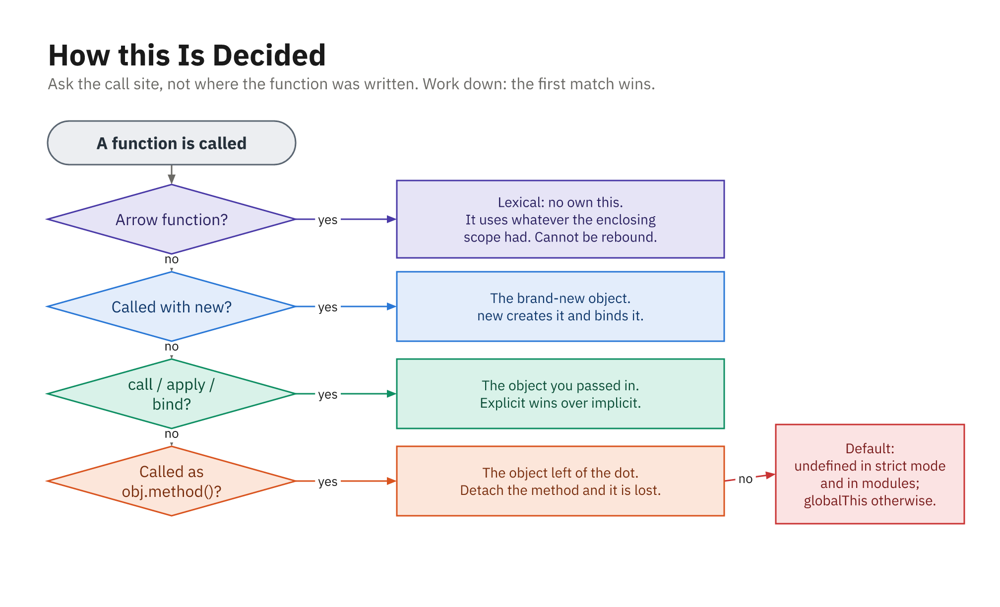

## Two Big Ideas

- Regular `function` → **call-site** `this` (how it's called)
- Arrow `=>` → **lexical** `this` (where it's defined)
- Choosing correctly avoids most `this` confusion

```js
function showThis() { console.log(this); }

const obj = { showThis };
obj.showThis(); // this = obj

const ref = obj.showThis;
ref();          // this = global / undefined
```

## Call-Site `this` Patterns

- `obj.method()` → `this` is `obj`
- Detached call → `this` is global / undefined

```js
const user = {
  name: "Alice",
  sayHi: function () {
    console.log("Hi, I am", this.name);
  }
};

user.sayHi();           // "Hi, I am Alice"
const greet = user.sayHi;
greet();                // this.name is undefined
```

## Ask the Call Site, Not the Definition

| How it is called | `this` is |
|---|---|
| `new Fn()` | the brand-new object |
| `fn.call(x)` / `.apply` / `.bind(x)` | whatever you passed |
| `obj.method()` | `obj`, left of the dot |
| `fn()` bare | `undefined` (strict) / `globalThis` |
| any arrow function | the **enclosing** scope's `this` |

- Work down the list; the first match wins

## The Nested Function Problem

- An inner `function` has its **own** call-site `this`
- Inside `setTimeout` it is **not** the outer object

```js
const counter = {
  value: 0,
  start: function () {
    setTimeout(function () {
      this.value++;            // this is NOT counter
      console.log(this.value); // wrong
    }, 1000);
  }
};

counter.start();
```

## Old Workarounds

- Save `this` in a variable, or `.bind(this)`
- Both work but are wordy and easy to forget

```js
start: function () {
  const self = this;                 // capture
  setTimeout(function () {
    self.value++;
  }, 1000);

  setTimeout(function () {
    this.value++;
  }.bind(this), 1000);               // or bind
}
```

## Arrow Functions to the Rescue

- Arrows have **no own `this`**; they use the surrounding one
- No `self = this`, no `.bind` needed

```js
const counter = {
  value: 0,
  start: function () {
    setTimeout(() => {
      this.value++;            // this is counter
      console.log(this.value);
    }, 1000);
  }
};

counter.start();
```

## Arrows in Array Callbacks

- Same fix inside `forEach`, `map`, event listeners
- Arrow reuses the method's `this`

```js
const list = {
  items: ["a", "b", "c"],
  logAll: function () {
    this.items.forEach((item) => {
      console.log(this.items.length, item); // this is list
    });
  }
};

list.logAll();
```

## Pitfall: Arrow as a Method

- An arrow **method** captures the outer (often global) `this`
- Use `function` to define methods; arrows for nested callbacks

```js
const user = {
  name: "Alice",
  sayHi: () => {
    console.log("Hi", this.name); // NOT user
  }
};

user.sayHi(); // this.name is undefined
```

## Class Arrow Fields Survive Detaching

- A class field holding an arrow captures `this` at construction

```js
class Watch {
  count = 0;
  ring = () => {          // arrow FIELD, not a method
    this.count++;
    console.log(this.count);
  };
}

const w = new Watch();
const detached = w.ring;
detached(); // 1 - still bound
```

- Use it for handlers you pass elsewhere, not for every method

## The Whole Decision, on One Page



- Work down the list: the first rule that matches wins
- Ask the **call site**, not where the function was written
