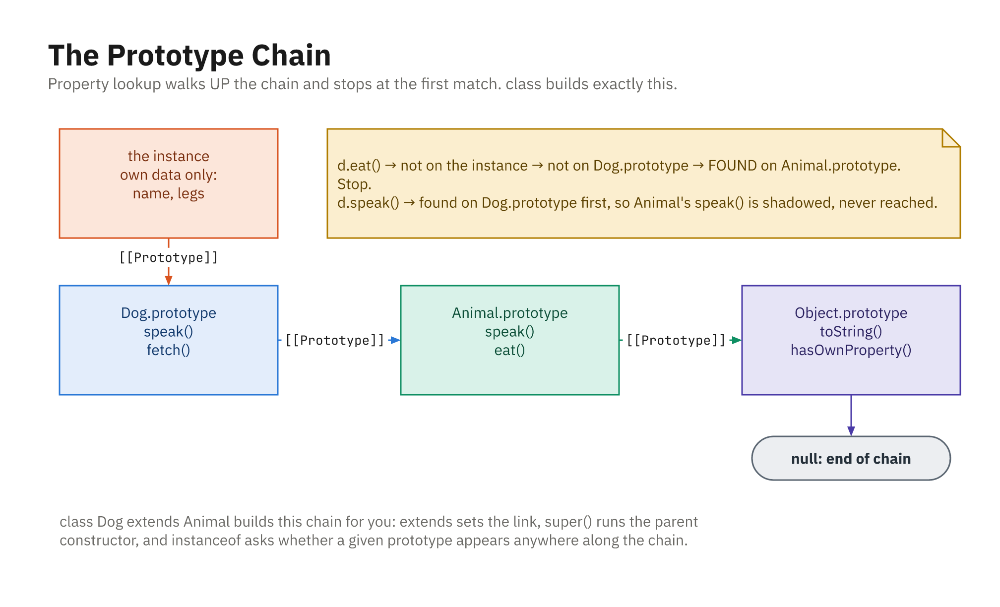

## Function Constructors + `new`

- Pre-`class` blueprint: a capitalized function
- `new` creates an object, links its prototype, runs with `this`, returns it

```js
function Person(name, age) {
  this.name = name;
  this.age = age;
}

const alice = new Person("Alice", 30);
console.log(alice.name); // "Alice"
```

- Forget the `new` and `this` is not the new object, a classic bug

## The `.prototype` Property

- Every function has a `prototype` object
- Methods put there are **shared** by all instances (one copy)

```js
function Person(name) { this.name = name; }

Person.prototype.greet = function () {
  console.log("Hi, I'm " + this.name);
};

const alice = new Person("Alice");
const bob = new Person("Bob");
console.log(alice.greet === bob.greet); // true - same function
```

## The Prototype Chain

- Lookup checks the object, then its prototype, then up to `null`
- Data lives on the instance; behavior on the prototype

```js
function Person(name) { this.name = name; }
Person.prototype.greet = function () { return "Hi, " + this.name; };

const alice = new Person("Alice");
console.log(Object.hasOwn(alice, "name"));  // true
console.log(Object.hasOwn(alice, "greet")); // false - on prototype
```

## Walking the Chain Yourself

```js
const alice = new Person("Alice");

Object.getPrototypeOf(alice) === Person.prototype;        // true
Object.getPrototypeOf(Person.prototype) === Object.prototype; // true
Object.getPrototypeOf(Object.prototype);                  // null
```

- Three hops and you are at the top
- A property missing from the whole chain is `undefined`, **not** an error

## `Object.create` and `instanceof`

- `Object.create(proto)` picks a prototype directly, no constructor
- `instanceof` checks if a constructor's prototype is in the chain

```js
const animal = { describe() { return this.type + " " + this.name; } };
const dog = Object.create(animal);
dog.type = "dog"; dog.name = "Rex";
console.log(dog.describe()); // "dog Rex"

console.log(dog instanceof Object); // true
```

## Own Properties Shadow Inherited Ones

```js
const animal = { speak() { return "generic sound"; } };

const cat = Object.create(animal);
cat.speak = function () { return "meow"; };  // own

const dog = Object.create(animal);           // no own speak

console.log(cat.speak()); // "meow"          - own wins
console.log(dog.speak()); // "generic sound" - inherited
console.log(Object.hasOwn(cat, "speak")); // true
console.log(Object.hasOwn(dog, "speak")); // false
```

## `class` Is Syntax Sugar

- `class` uses the **same** constructors and prototypes underneath
- Methods still land on `ClassName.prototype`

```js
class Animal2 {
  constructor(name) { this.name = name; }
  speak() { return this.name + " makes a sound"; }
}

const a = new Animal2("Rex");
console.log(Object.hasOwn(a, "speak")); // false - on prototype
console.log(a instanceof Animal2);      // true
```

## The Mapping, Piece by Piece

| Constructor function | `class` |
|---|---|
| `function Person(n) { ... }` | `constructor(n) { ... }` |
| `Person.prototype.greet = fn` | `greet() { ... }` |
| `Child.prototype = Object.create(Parent.prototype)` | `class Child extends Parent` |
| `Parent.call(this, args)` | `super(args)` |
| `Person.helper = fn` | `static helper() { ... }` |

- Same machinery, far less ceremony, and no chance to forget a step

## The Chain a Constructor Builds



- `[[Prototype]]` links every object up to `Object.prototype`, then `null`
- `instanceof` just asks whether a prototype appears along the chain
