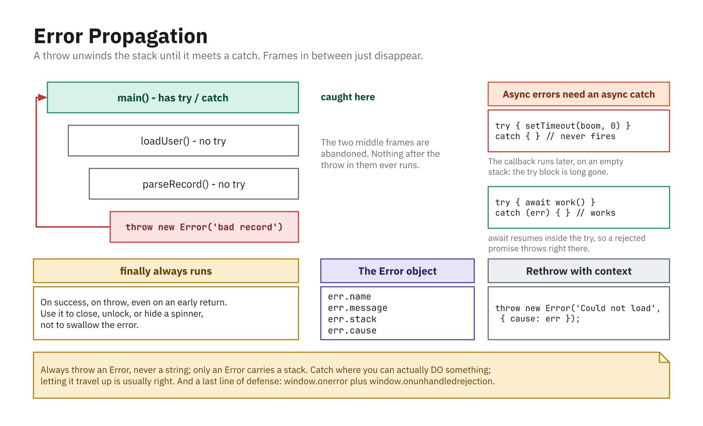

## Defensive Checks

- Don't assume DOM elements or data exist
- Missing element returns `null` → guard before use
- Early `return` keeps code flat and clear

```js
function setupButton() {
  const button = document.getElementById("submit");
  if (!button) {
    console.warn("Submit button missing; skipping.");
    return;
  }
  button.addEventListener("click", () => console.log("Clicked!"));
}
```

## `try` / `catch` / `finally`

- Wrap risky code so a throw doesn't crash the script
- `catch` handles the error; `finally` always runs

```js
try {
  const data = JSON.parse('{ "name": "Alice", }'); // invalid
  console.log(data);
} catch (error) {
  console.error("Failed to parse:", error.message);
} finally {
  console.log("Done (success or fail)");
}
```

## The Error Object

- A thrown error is usually an `Error` object
- Useful fields: `name`, `message`, `stack`
- `TypeError`, `ReferenceError`, etc. handled the same way

```js
try {
  throw new Error("Something went wrong");
} catch (error) {
  console.log(error.name);    // "Error"
  console.log(error.message); // "Something went wrong"
}
```

## Throwing Your Own Errors

- Signal problems with clear, specific messages
- Lets calling code decide what to do

```js
function getUserName(user) {
  if (!user || !user.name) {
    throw new Error("User object must have a name");
  }
  return user.name;
}

try {
  getUserName({});
} catch (error) {
  console.error(error.message);
}
```

## Always Throw an `Error`

```js
throw "Something broke";        // legal, but avoid
throw new Error("Something broke"); // do this
```

- A string has no `.message`, no `.stack`, and fails `instanceof Error`
- Anything that catches it has to guess what it received
- The same rule applies to `reject(...)` in a promise

## Custom Error Types

- Extend `Error` when callers need to tell errors apart
- Carry extra context as properties

```js
class ValidationError extends Error {
  constructor(field, message) {
    super(message);
    this.name = "ValidationError";
    this.field = field;
  }
}
```

## Catching One Kind of Error

```js
try {
  throw new ValidationError("email", "Email is required");
} catch (error) {
  if (error instanceof ValidationError) {
    console.log(error.field, error.message);
  } else {
    throw error;   // not ours - pass it on
  }
}
```

- **Re-throw what you did not expect.** A bare `catch` that swallows
  everything turns a real bug into silence

## `finally` Runs No Matter What

```js
function read() {
  try {
    return "value";      // returns...
  } finally {
    console.log("cleanup"); // ...but this runs FIRST
  }
}

console.log(read());
// "cleanup"
// "value"
```

- Runs on success, on throw, and even on `return`
- The right home for closing, unlocking, or re-enabling a button

## Handling Async Errors

- Promises: attach `.catch` to the chain
- `async`/`await`: use ordinary `try` / `catch`

```js
async function loadUser() {
  try {
    const res = await fetch("/api/user");
    if (!res.ok) throw new Error("Network error: " + res.status);
    const data = await res.json();
    console.log("User:", data);
  } catch (error) {
    console.error("Could not load user:", error.message);
  }
}
```

- `fetch` only rejects on a **network** failure; check `res.ok` yourself

## How a Throw Travels



- It unwinds the stack to the nearest `catch`; frames in between are abandoned
- `finally` always runs; a sync `try` cannot catch an async throw
