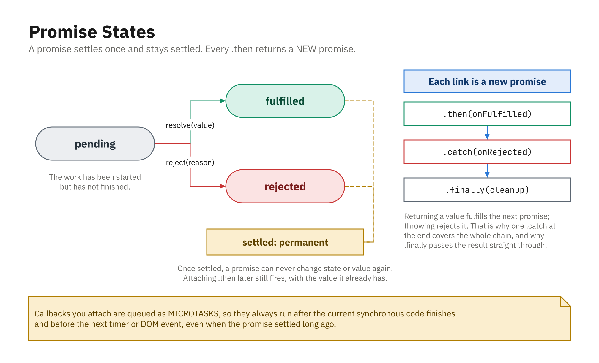

## What Is a Promise?

- An object representing a value you'll get **now**, **later**, or **never**
- Three states:
  - `pending`: still working
  - `fulfilled`: finished successfully
  - `rejected`: finished with an error

```js
const promise = new Promise((resolve, reject) => {
  const success = true;
  if (success) resolve("It worked!");
  else reject(new Error("Something went wrong"));
});
```

- A promise settles **once**; later `resolve`/`reject` calls are ignored

## Consuming a Promise

- `.then` handles success, `.catch` handles errors

```js
promise
  .then((value) => {
    console.log("Success:", value);
  })
  .catch((error) => {
    console.log("Error:", error.message);
  });
```

- `resolve` → fulfilled; `reject` → rejected

## Always Reject With an `Error`

```js
reject("Failed to load");             // legal, but avoid
reject(new Error("Failed to load"));  // do this
```

- A string rejection has no `.message`, no `.stack`, no `instanceof Error`
- Your `.catch` then has to guess what it was handed
- Same rule as `throw`; see Error Handling

## Promises vs Callbacks

- Plain callbacks nest into pyramids; error handling gets messy
- Promises **chain**: each `.then` returns a new promise

```js
doSomething()
  .then((result) => doSomethingElse(result))
  .then((nextResult) => console.log("Next:", nextResult))
  .catch((error) => console.error("Error:", error.message));
```

- One central `.catch` handles the whole chain

## You Must `return` Inside `.then`

```js
step1()
  .then((r) => { step2(r); })        // WRONG - nothing waits for step2
  .then(() => console.log("done"));  // runs too early

step1()
  .then((r) => step2(r))             // right - return the promise
  .then(() => console.log("done"));
```

- Returning a promise makes the **next** `.then` wait for it
- Forget the `return` and the chain silently runs out of order

## `.finally` and Cleanup

```js
showSpinner();

loadData()
  .then((data) => render(data))
  .catch((error) => showError(error.message))
  .finally(() => hideSpinner());   // runs either way
```

- `.finally` gets no value and does not change the result
- The right home for spinners, unlocking, re-enabling a button

## Promises and the Event Loop

- `.then` / `.catch` / `.finally` **never run immediately**
- They are scheduled on the **microtask queue**
- The loop finishes current code, drains **all microtasks**, then the next task
- So promise handlers run **before** `setTimeout(..., 0)`

## Ordering Example

```js
console.log("A");
Promise.resolve().then(() => console.log("Promise"));
setTimeout(() => console.log("Timeout"), 0);
console.log("B");
// A
// B
// Promise   <- microtask
// Timeout   <- macrotask
```

- Sync code first, then microtasks, then timers

## Converting Callbacks to Promises

```js
function loadData() {
  return new Promise((resolve, reject) => {
    setTimeout(() => {
      resolve("Data loaded");
    }, 1000);
  });
}

loadData()
  .then((data) => console.log(data))
  .catch((error) => console.error(error.message));
```

- Now works with `.then`/`.catch`, `Promise.all`, and `async/await`

## States and the Chain



- Settled is permanent, and every `.then` returns a **new** promise
- Callbacks are queued as microtasks, so they never run synchronously
