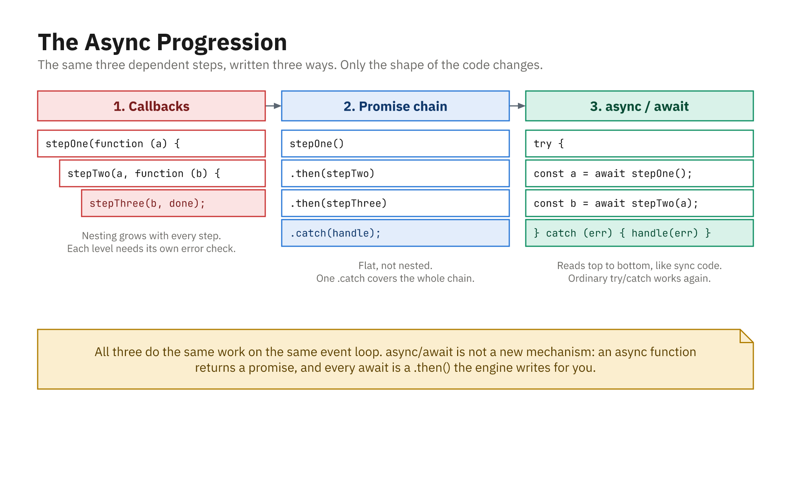
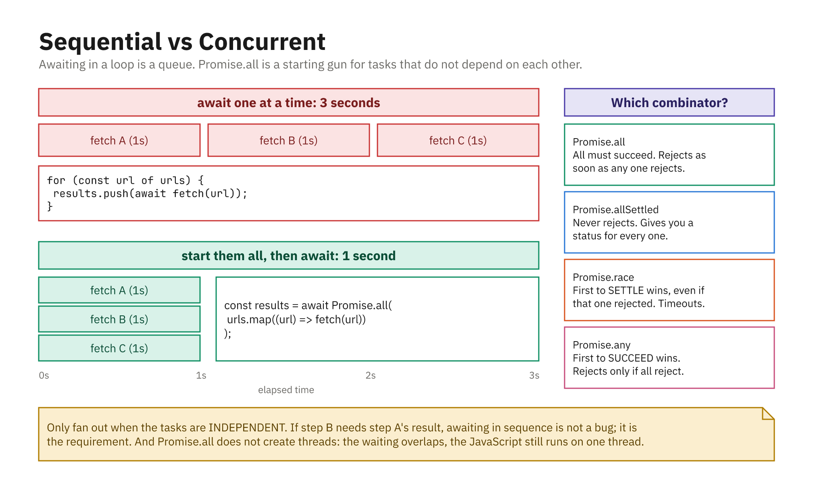

## Async Code That Reads Like Sync

- `async/await` makes async code look step-by-step
- Built on **promises**; still uses the **event loop**

```js
async function showUserAndPosts() {
  try {
    const user = await loadUser();
    const posts = await loadPosts(user.id);
    console.log("User:", user);
    console.log("Posts:", posts);
  } catch (error) {
    console.error(error.message);
  }
}
showUserAndPosts();
```

## How It Works

- Two key rules:
  1. An `async` function **always returns a promise**
  2. `await` pauses until that promise settles

```js
async function getNumber() {
  return 42; // actually Promise.resolve(42)
}

getNumber();        // Promise { 42 } - not 42!
await getNumber();  // 42
```

- `await` returns the fulfilled value, or **throws** the rejection

## The Same Chain, Both Ways

```js
// promises
step1()
  .then((a) => step2(a))
  .then((b) => step3(b))
  .catch((e) => console.error(e.message));

// async/await - identical behavior
try {
  const a = await step1();
  const b = await step2(a);
  await step3(b);
} catch (e) {
  console.error(e.message);
}
```

## Where `await` Is Allowed

- Inside any `async` function
- At the **top level of an ES module** (top-level `await`, ES2022)

```js
// app.mjs, or a .js file in a "type": "module" package
const res = await fetch("/api/config");
const config = await res.json();
```

- In a plain CommonJS script: `SyntaxError: await is only valid in async functions`
- When in doubt, wrap it in an `async` function; that works everywhere

## Error Handling with try/catch

- Any rejected promise in the `try` block acts like a thrown error

```js
async function run() {
  try {
    const data = await loadData();
    const result = await processData(data);
    console.log("Result:", result);
  } catch (error) {
    console.error("Error:", error.message);
  }
}
run();
```

- One `catch` can handle them all

## Fine-Grained Error Handling

- Use multiple `try`/`catch` blocks for separate control

```js
async function run() {
  let data;
  try {
    data = await loadData();
  } catch (error) {
    console.error("Failed to load data:", error.message);
    return;
  }
  try {
    const result = await processData(data);
    console.log("Result:", result);
  } catch (error) {
    console.error("Failed to process data:", error.message);
  }
}
```

## Async/Await and the Event Loop

- At each `await`:
  - The `async` function **pauses**
  - The rest is scheduled as a **microtask** (like a `.then`)
  - The event loop can run other tasks meanwhile
  - When the promise settles, the function resumes
- In short: nice syntax for promises, same microtask queue

## The Bug Everyone Writes Once

```js
async function getTotal() { return 42; }

const total = getTotal();        // Promise { 42 }
console.log(total + 1);          // "[object Promise]1"

const real = await getTotal();   // 42
console.log(real + 1);           // 43
```

- Forgetting `await` rarely errors; it just gives you a promise
- If a value prints as `Promise { ... }`, you missed an `await`

## The Same Three Steps, Three Ways



- `async`/`await` is not a new mechanism; every `await` is a `.then`
- Ordinary `try`/`catch` works again

## Sequential vs Concurrent



- Awaiting in a loop is a queue; `Promise.all` is a starting gun
- Only fan out when the tasks are genuinely independent
