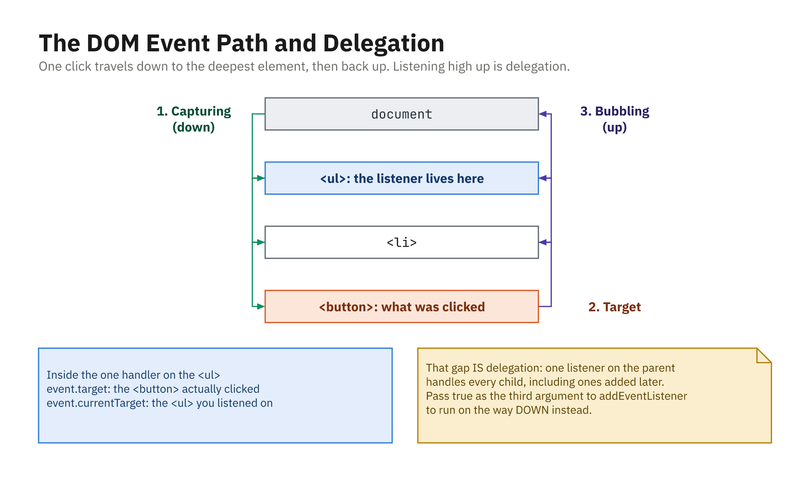

## Scoped, `matches`, `closest`

- Query **inside** an element, not just `document`
- `matches`: does this element match a selector?
- `closest`: nearest matching ancestor (including itself)

```js
const card = document.querySelector(".card");
const title = card.querySelector(".title"); // search inside

el.matches(".item.active");   // true / false
button.closest(".menu");      // nearest ancestor <ul>
```

- `closest` is what makes event delegation reliable

## Modifying Content

- `textContent`: plain text (safe)
- `innerHTML`: parses HTML (never with untrusted input)

```js
title.textContent = "New title";

box.innerHTML = "<strong>Bold</strong> and <em>italic</em>";
// Avoid innerHTML with user input - XSS risk
```

- If the value came from a user or a server, use `textContent`

## Attributes and Classes

- Set attributes directly or with `setAttribute`
- Prefer `classList` over replacing `className`

```js
img.src = "new.png";
img.setAttribute("data-role", "avatar");
img.getAttribute("data-role"); // "avatar"

panel.classList.add("active");
panel.classList.remove("active");
panel.classList.toggle("active");
panel.classList.contains("active"); // true / false
```

## `dataset`: Attach Data to an Element

- Any `data-*` attribute is readable through `dataset`

```html
<li data-id="42" data-user-name="ada">Ada</li>
```

```js
li.dataset.id;       // "42"   - always a STRING
li.dataset.userName; // "ada"  - data-user-name becomes userName

li.dataset.id = 43;  // writes data-id="43"
Number(li.dataset.id); // convert when you need a number
```

- The natural place to keep the record id a list item represents

## Removing Elements

- `element.remove()`: modern, removes itself
- `parent.removeChild(child)`: older style
- `innerHTML = ''` clears all children

```js
button.remove();

list.removeChild(item);

log.innerHTML = ""; // clear everything inside
```

## Adding and Removing Listeners

- `addEventListener(type, handler, options?)`
- Remove with the **same** function reference
- Anonymous functions cannot be removed

```js
function onClick() { console.log("clicked"); }

btn.addEventListener("click", onClick);
btn.removeEventListener("click", onClick);
```

- Listen on the **form** for `submit`, not `click` on the button

## The Event Object

- Handlers receive an event with details
- `type`, `target`, mouse/key data

```js
btn.addEventListener("click", (event) => {
  console.log(event.type);    // "click"
  console.log(event.target);  // the clicked element
  console.log(event.clientX); // mouse X
});
```

## Capture and Bubble



- Listeners default to **bubbling**; pass `{ capture: true }` for the way down
- `target` is what was clicked, `currentTarget` is where you listened

## Stopping and Preventing

- `stopPropagation()`: halt the event's travel
- `preventDefault()`: cancel the browser default
- `{ once: true }`: auto-remove after the first run

```js
innerBtn.addEventListener("click", (e) => {
  e.stopPropagation(); // outer won't be notified
});

link.addEventListener("click", (e) => {
  e.preventDefault(); // don't navigate
});
```

## Event Delegation

- One parent listener handles many children
- Works for elements added **later**

```js
list.addEventListener("click", (event) => {
  const item = event.target.closest(".item");
  if (!item || !list.contains(item)) return;

  console.log("Clicked:", item.textContent, item.dataset.id);
});
```

- The gap between `target` and `currentTarget` is what makes this work

## Inline Styles

- `element.style` sets inline styles (highest priority)
- Properties are **camelCase**; values are strings with units

```js
btn.style.color = "white";
btn.style.backgroundColor = "blue"; // not "background-color"
btn.style.padding = "10px 20px";

btn.style.width = 50;     // ignored - no unit
btn.style.width = "50px"; // works
```

## Styling with Classes

- Preferred: keep styles in CSS, toggle classes in JS

```js
message.classList.add("highlight");
message.classList.remove("highlight");
message.classList.toggle("highlight");

if (message.classList.contains("highlight")) {
  console.log("It is highlighted");
}
```

- One class swap can drive a dozen CSS rules, and animate

## CSS Variables and Computed Styles

- Set CSS custom properties as theme "knobs"
- `getComputedStyle` reads the **final** applied values (read-only)

```js
document.documentElement.style
  .setProperty("--main-bg", "black");

const styles = getComputedStyle(box);
console.log(styles.color);      // "rgb(0, 0, 255)"
console.log(styles.paddingTop); // "20px"
```

- `element.style.color` shows only **inline** styles, often empty

## Choosing an Approach

- **Classes**: reusable styles, CSS transitions, maintainability
- **Inline**: a single dynamic value computed in JS
- **CSS variables**: theme/settings shared across many rules

```js
// dynamic value -> inline style is natural
bar.style.width = value + "%";
```
