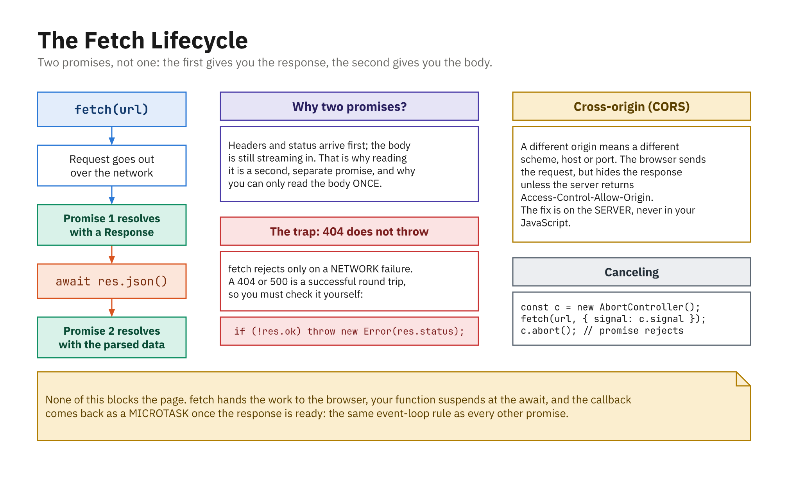

## Basic Idea

- Modern way to make HTTP requests from the browser
- Built on **promises**: works with `.then()` and `async/await`
- `fetch(url, options?)` resolves to a `Response`

```js
const res = await fetch("https://api.example.com/users");
const data = await res.json();
console.log(data);
```

- Two steps: the **response arrives**, then you **read the body**

## `fetch` Does Not Throw on 404

```js
const res = await fetch("/api/missing");

console.log(res.ok);     // false
console.log(res.status); // 404
// ...but no error was thrown!
```

- A promise rejection means a **network** failure, not an HTTP error
- The server answering "404" is a successful round trip, as far as `fetch` is concerned
- **Always check `res.ok` yourself**

## GET with async/await

- Check `response.ok` before parsing
- Network and thrown errors land in `catch`

```js
async function getUsers() {
  try {
    const res = await fetch("https://api.example.com/users");
    if (!res.ok) throw new Error("Status " + res.status);

    const data = await res.json();
    console.log("Users:", data);
  } catch (error) {
    console.error("Fetch error:", error.message);
  }
}
```

## POST: Create a Resource

- Set `method` and a `Content-Type` header
- `body` must be a string; use `JSON.stringify`

```js
const res = await fetch("https://api.example.com/users", {
  method: "POST",
  headers: { "Content-Type": "application/json" },
  body: JSON.stringify({ name: "Alice", email: "a@example.com" }),
});

if (!res.ok) throw new Error("Failed to create user");
const created = await res.json();
```

## PUT, PATCH, DELETE

- `PUT`: replace the whole resource
- `PATCH`: update only some fields
- `DELETE`: remove; may return `204 No Content`

```js
// PATCH: partial update
await fetch(`https://api.example.com/users/${id}`, {
  method: "PATCH",
  headers: { "Content-Type": "application/json" },
  body: JSON.stringify({ email }),
});

// DELETE
await fetch(`https://api.example.com/users/${id}`, {
  method: "DELETE",
});
```

## Reading the Response

```js
await res.json();  // parse JSON  -> object
await res.text();  // raw text    -> string
await res.blob();  // binary      -> Blob

res.headers.get("content-type"); // "application/json"
```

- You can read the body **once**; a second `.json()` throws
- A `204 No Content` has no body at all, so do not call `.json()` on it

## Canceling a Request: `AbortController`

- A request with no timeout can hang forever

```js
const controller = new AbortController();
const timer = setTimeout(() => controller.abort(), 5000);

try {
  const res = await fetch(url, { signal: controller.signal });
  clearTimeout(timer);
} catch (error) {
  if (error.name === "AbortError") console.log("Canceled");
  else throw error;
}
```

- Also use it when the user navigates away or retypes a search

## Fetch and the Event Loop

- The request runs in the browser's **Web APIs**, not in JS itself
- The response resolves the promise
- The continuation is scheduled as a **microtask**
- The event loop runs it when the stack is free

> "Start a network request now, run this code later when the result is ready."

## Two Promises, Not One



- The body is a stream, so `.json()` is a second promise
- A 404 does not throw; check `res.ok` yourself
