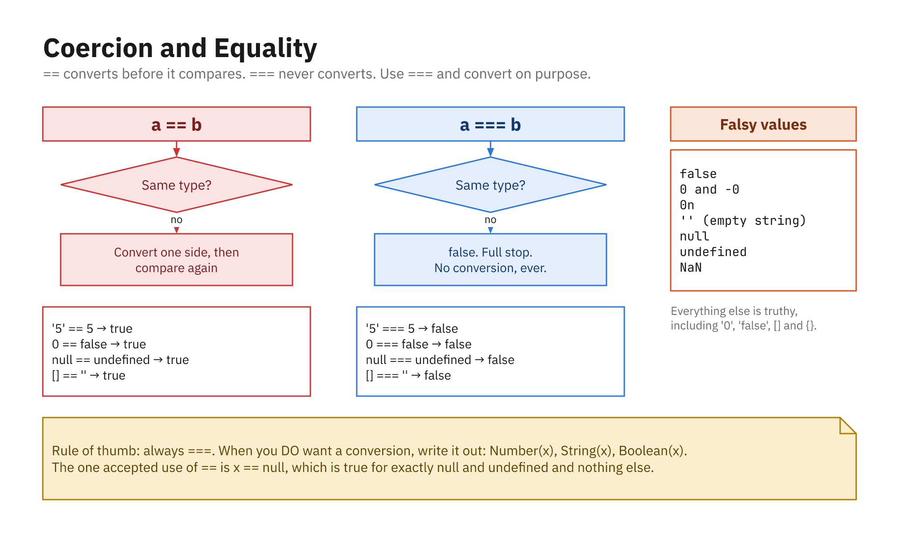
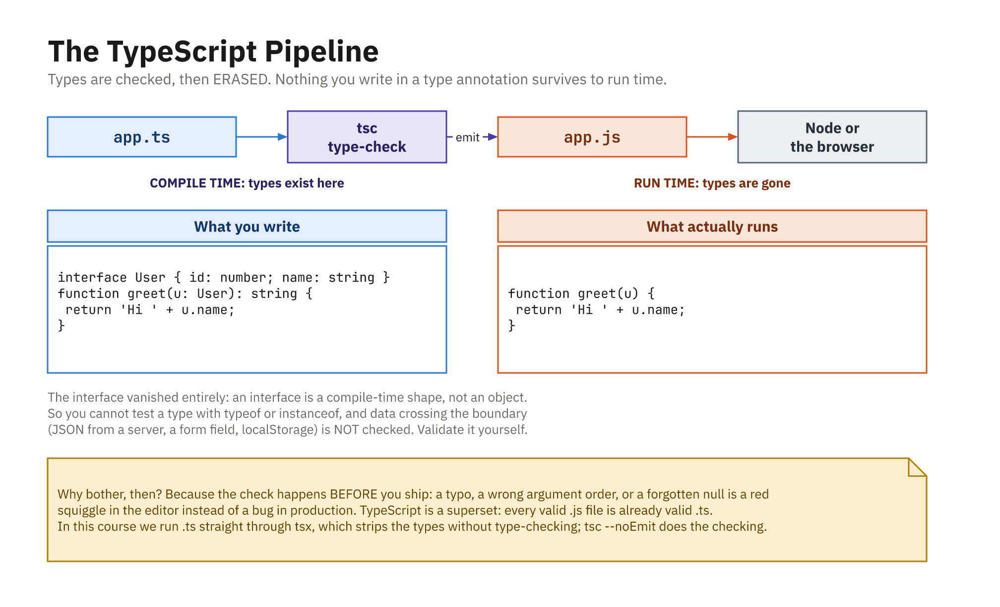

## TypeScript Is JavaScript with Types

- A language built on top of JavaScript that adds a **type system**
- Types describe the shape of your data and are checked **before** code runs
- Every valid JavaScript program is already a valid TypeScript program
- You still write JavaScript; you just also write down your intentions
- Files use `.ts` (or `.tsx` for React)

## Why Bother? Errors at Your Desk

```js
function total(price, quantity) { return price * quantity; }
total("10", 5); // 50 - worked by accident; "10" was coerced
```

```ts
function total(price: number, quantity: number): number {
  return price * quantity;
}
total("10", 5);
// Error: Argument of type 'string' is not assignable to
//        parameter of type 'number'.
```

- The bug surfaces **in the editor**, not in production
- The editor also gains real autocomplete, safe renames, go-to-definition

## Static vs Dynamic, Strong vs Loose

- **Dynamic** (JavaScript): types checked at **runtime**; a variable can change type
- **Static** (TypeScript): types checked **ahead of time**, before the program runs
- **Loosely typed** (JavaScript): freely **coerces** between types
- **Strongly typed**: resists silent conversions and expects you to be explicit
- These are two independent axes; JavaScript is dynamic *and* loose
- TypeScript makes it static; it stays loose at runtime

## Type Coercion Is Still There



- TypeScript **flags** the risky ones (`"5" - 3`, `0 == ""`) at compile time
- Nothing changes at run time; the coercion rules are still JavaScript's

## Types Are Erased Before It Runs



- Node and the browser only ever run plain JavaScript, no runtime cost
- So a type cannot check data that only arrives at run time. Validate it yourself

## Running TypeScript

```powershell
npx tsx app.ts       # strip types and run - what this course uses
node app.ts          # Node 24+ can too, but see below
npx tsc --noEmit     # full type-check, emit nothing
npx tsc app.ts       # type-check AND emit app.js
```

- Neither `tsx` **nor** `node` type-checks; both just strip and run
- Node **strips only**: `enum`, `namespace`, and `constructor(private x: number)`
  all fail with `ERR_UNSUPPORTED_TYPESCRIPT_SYNTAX`. Two demos this week use
  the last one, so we use `tsx`
- `tsconfig.json` holds the options; **`"strict": true`** is the one that matters

## Type Annotations on Variables

```ts
let age: number = 30;
let firstName: string = "Ada";
let isAdmin: boolean = false;

age = "thirty";
// Error: Type 'string' is not assignable to type 'number'.
```

- A **type annotation** is a colon and a type after the name
- Once annotated, the variable is locked to that type

## Primitive Types

```ts
let count: number = 42;      // ints and floats are both `number`
let title: string = "Hello";
let done: boolean = true;
let nothing: null = null;
let missing: undefined = undefined;
let big: bigint = 100n;
let key: symbol = Symbol("id");
```

- Type names are **lowercase**
- No separate integer/float type; every number is `number`

## Type Inference

```ts
let city = "Boston"; // inferred as string
city = 42;           // Error: 'number' not assignable to 'string'

let total = 0;       // inferred as number
const PI = 3.14159;  // inferred as the literal 3.14159
```

- TypeScript **infers** the type from the assigned value
- Let TS infer obvious locals; annotate parameters and boundaries
- `let city: string = "Boston"` is redundant; inference already knows

## `any`, `unknown`, `never`

```ts
let data: any = 5;
data.foo.bar.baz;   // no error - but crashes at runtime

let input: unknown = fetchSomething();
input.toUpperCase();          // Error: 'input' is of type 'unknown'
if (typeof input === "string") input.toUpperCase(); // OK after check

function fail(message: string): never {
  throw new Error(message);   // never returns normally
}
```

- `any` opts **out** of checking (avoid); `unknown` is the safe version

## Arrays and Tuples

```ts
let scores: number[] = [90, 85, 100];
let names: Array<string> = ["Ada", "Alan"]; // equivalent generic form

scores.push("hello");
// Error: 'string' is not assignable to 'number'.

// A tuple: fixed length, a type per position
let entry: [string, number] = ["age", 30];
entry[0].toUpperCase(); // position 0 is a string
entry[1].toFixed(2);    // position 1 is a number
```

## Union and Literal Types

```ts
let id: number | string;
id = 101;      // OK
id = "A-101";  // OK
id = true;     // Error: 'boolean' not assignable

let direction: "up" | "down" | "left" | "right";
direction = "up";     // OK
direction = "north";  // Error: not one of the allowed literals
```

- A **union** (`|`) means "one of these types"
- A **literal type** narrows to exact values, TS's lightweight enum

## Typing Function Parameters and Returns

```ts
function add(a: number, b: number): number {
  return a + b;
}
add(2, "3"); // Error: 'string' not assignable to 'number'

function greet(name: string): string {
  return `Hi, ${name}`;
}

const multiply = (a: number, b: number): number => a * b;
```

- Annotate each **parameter**; the return type is often inferred but documents intent

## Optional, Default, and `void`

```ts
function greet(name: string, title?: string): string {
  return title ? `Hello, ${title} ${name}` : `Hello, ${name}`;
}

function increment(value: number, step = 1): number {
  return value + step; // default makes step optional
}

function logMessage(message: string): void {
  console.log(message); // returns nothing
}
```

- `?` = optional (must follow required params); a default supplies a fallback
- `void` = returns nothing; differs from `never` (which never finishes)
