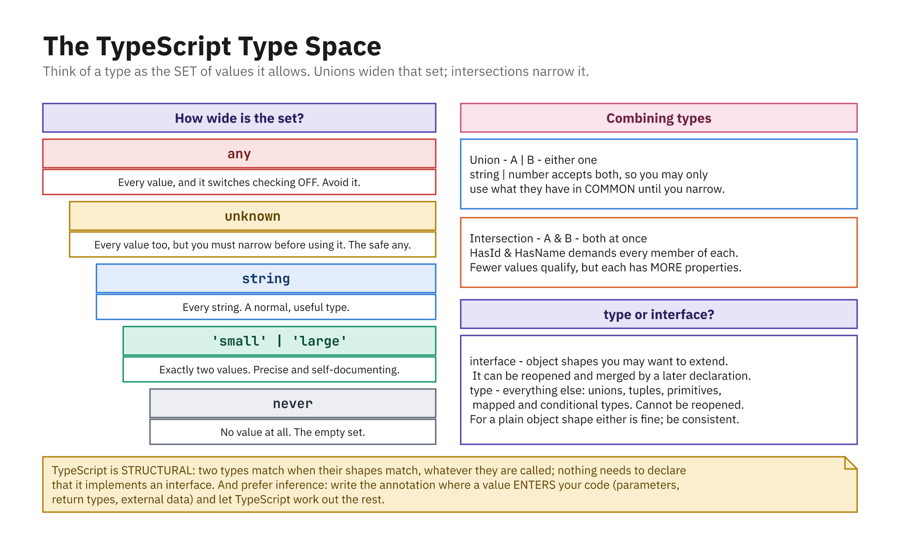

## Object Types and Type Aliases

```ts
// Inline shape - works, but tedious to repeat:
let user: { name: string; age: number } = { name: "Ada", age: 30 };

// A type alias names ANY type:
type User = { name: string; age: number };
const ada: User = { name: "Ada", age: 30 };

type ID = number | string;       // union
type Point = [number, number];   // tuple
type Direction = "up" | "down";  // literal union
```

- Only aliases can name unions, tuples, and primitives

## Interfaces

```ts
interface User {
  name: string;
  age: number;
}

const ada: User = { name: "Ada", age: 30 };
```

- An **interface** describes only **object-like** shapes (objects, classes, functions)
- Cannot name a union or primitive
- In exchange: `extends` and declaration merging

## Optional and Readonly Properties

```ts
interface User {
  name: string;
  nickname?: string;  // optional - may be absent
}

interface Account {
  readonly id: number;
  balance: number;
}

const acct: Account = { id: 1, balance: 100 };
acct.balance = 150; // OK
acct.id = 2;        // Error: 'id' is read-only
```

- Both `type` and `interface` support `?` and `readonly`
- `readonly` is compile-time only; it does not freeze the object at runtime

## Extending and Merging

```ts
interface Animal { name: string; }
interface Dog extends Animal { breed: string; } // inherits name

type Animal2 = { name: string };
type Dog2 = Animal2 & { breed: string };        // intersection

interface Box { width: number; }
interface Box { height: number; }               // merges - needs both
```

- Interfaces extend with **`extends`**; type aliases combine with **`&`**
- Only interfaces support **declaration merging** (same name twice)

## Index Signatures

```ts
interface ScoreBoard {
  [player: string]: number;
}

const scores: ScoreBoard = {};
scores["Ada"] = 90;
scores["Alan"] = 85;
scores["Grace"] = "high";
// Error: Type 'string' is not assignable to type 'number'.
```

- Describes objects whose **keys aren't known ahead of time**
- Reads as "any string key maps to a number value", types dictionaries

## Structural Typing

- TypeScript matches on **shape**, not on name

```ts
interface Point { x: number; y: number; }

function print(p: Point) { console.log(p.x, p.y); }

const thing = { x: 1, y: 2, label: "extra" };
print(thing); // OK - it HAS x and y

print({ x: 1, y: 2, label: "extra" });
// Error: object literals may only specify known properties
```

- A variable with extra properties passes; an inline **literal** does not
- That extra check exists to catch typos in option objects

## `type` vs `interface`: When to Use Which

- Reach for **`interface`** for the shape of an **object or class**, especially
  if it will be **extended** or **implemented**
- Reach for **`type`** for what an interface can't express: unions, tuples,
  primitives, composed types
- Reasonable default: **interfaces for object/class shapes, aliases for the rest**
- Above all, **be consistent** within a codebase

## How Wide Is the Set?



- A type is the **set** of values it allows
- Unions widen that set; intersections narrow it
