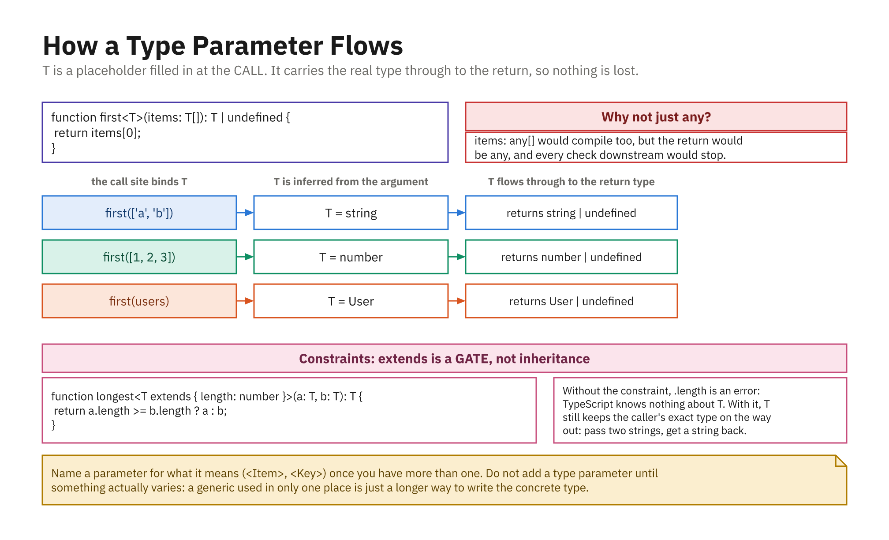
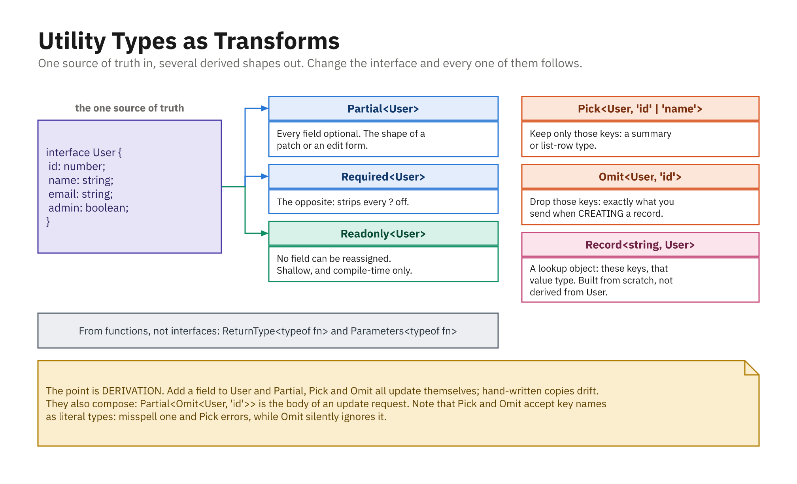

## Why Generics?

```ts
// Locked to one type - reusable for nothing else:
function identityNumber(value: number): number { return value; }

// any - reusable, but no safety:
function identity(value: any): any { return value; }
identity("hello").toFixed(2); // no compile error, CRASHES at runtime
```

- Generics give the best of both: **reuse AND type safety**

## Generic Functions

```ts
function identity<T>(value: T): T {
  return value;
}

const a = identity("hello"); // T is string
const b = identity(42);      // T is number
b.toUpperCase();
// Error: 'toUpperCase' does not exist on type 'number'.

const c = identity<string>("world"); // T set explicitly
```

- Declare a **type parameter** in `<T>`; TS **infers** it from the argument
- Supply it explicitly when there is nothing to infer from (an empty array)

## Constraints with `extends`

```ts
function longest<T extends { length: number }>(a: T, b: T): T {
  return a.length >= b.length ? a : b;
}

longest("apple", "kiwi");   // OK - strings have .length
longest([1, 2, 3], [4, 5]); // OK - arrays have .length
longest(10, 20);
// Error: 'number' not assignable to '{ length: number }'.
```

- A **constraint** limits `T`, "any type, as long as it has `.length`"
- Without it, you could not safely read `.length` inside the function

## Generic Interfaces and Aliases

```ts
interface ApiResponse<T> {
  status: number;
  data: T;
}

const res: ApiResponse<{ name: string }> = {
  status: 200,
  data: { name: "Ada" },
};
res.data.name; // string - the T is remembered

type Pair<K, V> = { key: K; value: V };
const entry: Pair<string, number> = { key: "age", value: 30 };
```

## Generic Classes

```ts
class Box<T> {
  private contents: T;
  constructor(value: T) { this.contents = value; }
  get(): T { return this.contents; }
  set(value: T): void { this.contents = value; }
}

const numberBox = new Box(123); // Box<number>
numberBox.set("no");
// Error: 'string' not assignable to 'number'.
```

- Exactly how built-in `Array<T>` and `Map<K, V>` are typed

## A Generic `Stack<T>`

```ts
class Stack<T> {
  private items: T[] = [];
  push(item: T): void { this.items.push(item); }
  pop(): T | undefined { return this.items.pop(); }
  peek(): T | undefined { return this.items[this.items.length - 1]; }
  get size(): number { return this.items.length; }
}

const words = new Stack<string>();
words.push("hello");
words.peek()?.toUpperCase(); // "HELLO"
```

- `pop` returns `T | undefined`; the empty case is in the type

## What Are Utility Types?

- Built-in **generic helpers** that transform an existing type into a new one
- Instead of hand-writing a variant, you **derive** it
- Keeps types **DRY**: change the original, every derived type updates

```ts
interface User {
  id: number;
  name: string;
  email: string;
  age: number;
}
```

## `Partial` and `Required`

```ts
type PartialUser = Partial<User>;
// { id?: number; name?: string; email?: string; age?: number }

function updateUser(id: number, changes: Partial<User>): void {}
updateUser(1, { email: "new@example.com" }); // OK - any subset

interface Config { host?: string; port?: number; }
type FullConfig = Required<Config>;
// { host: string; port: number } - both now required
```

## `Readonly`, `Pick`, and `Omit`

```ts
type FrozenUser = Readonly<User>;
const u: FrozenUser = { id: 1, name: "Ada", email: "a@example.com", age: 30 };
u.name = "Grace"; // Error: read-only

type UserPreview = Pick<User, "id" | "name">;
// { id: number; name: string }

type NewUser = Omit<User, "id">;
// { name: string; email: string; age: number }
```

- **`Pick`** keeps only named keys · **`Omit`** removes named keys

## `Record`: Build a Map Type

```ts
type Roles = "admin" | "editor" | "viewer";

type Permissions = Record<Roles, boolean>;
const perms: Permissions = {
  admin: true, editor: true, viewer: false,
}; // all three keys required - miss one and it will not compile

type PageViews = Record<string, number>;
const views: PageViews = { home: 100, about: 40 };
```

## `ReturnType` and Composing

```ts
function createUser(name: string) {
  return { id: 1, name, active: true };
}

type CreatedUser = ReturnType<typeof createUser>;
// { id: number; name: string; active: boolean }

// Utility types compose:
type DraftUser = Partial<Omit<User, "id">>;
// { name?: string; email?: string; age?: number }
```

- `ReturnType<typeof fn>` extracts a return type, and stays in sync
- Because all derive from `User`, editing `User` once updates every derived type

## How `T` Flows



- `T` is bound at the call site and carried through to the return
- That is the whole difference from `any`, which forgets

## Utility Types as Transforms



- One source of truth in, several derived shapes out
- Add a field and every derived type follows; hand-written copies drift
