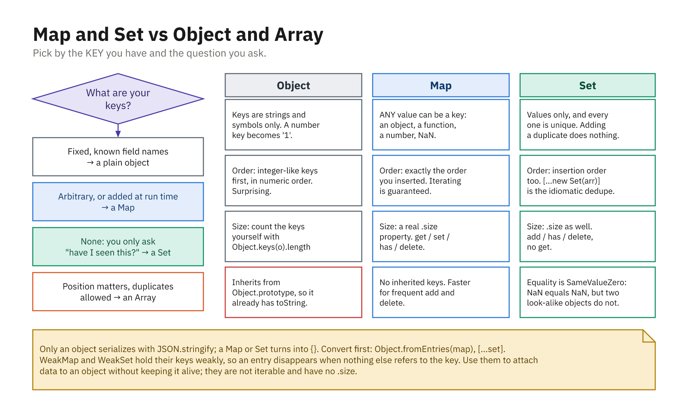

> **Reserve pair.** Runs only if the class finishes `01`-`30`. Note that this is the
> only coverage of outline IV.G, and Module 09's exit ticket asks about `Map`.

## `Map`: Keyed Collections Done Right

- Key/value pairs; keys can be **any** value; order preserved

```js
let prices = new Map();
prices.set("espresso", 3.5); // set(key, value)
prices.set("latte", 4.5);

prices.get("latte"); // 4.5
prices.get("mocha"); // undefined
prices.has("mocha"); // false
prices.size;         // 2   (a property, not size())
prices.delete("espresso");
```

- `set` returns the map, so calls chain

## Why `Map` Over an Object?

```js
let obj = {};
obj[1] = "a";
obj["1"] = "b";
obj[1];        // "b"  - number key coerced to string!

let map = new Map();
map.set(1, "a").set("1", "b");
map.get(1);    // "a"  - kept distinct
```

- Instant `.size`, no inherited-key surprises, guaranteed insertion order
- Use a plain object for fixed records; a `Map` for dynamic/non-string keys

## Iterating a `Map`

- `for...of` yields `[key, value]` pairs, destructure them

```js
let prices = new Map([
  ["espresso", 3.5],
  ["latte", 4.5],
]);

for (let [item, price] of prices) {
  console.log(`${item}: $${price}`);
}
[...prices.keys()];   // ["espresso", "latte"]
[...prices.values()]; // [3.5, 4.5]
```

- Seed from an array of `[key, value]` pairs

## Counting With a `Map`

- The canonical use: a tally where the keys are not known up front

```js
function tally(items) {
  const counts = new Map();
  for (const item of items) {
    counts.set(item, (counts.get(item) ?? 0) + 1);
  }
  return counts;
}

tally(["js", "css", "js"]); // Map { "js" => 2, "css" => 1 }

Object.fromEntries(tally(["js", "js"])); // { js: 2 }
```

## `Set`: Unique Values

```js
let tags = new Set();
tags.add("coffee");
tags.add("hot");
tags.add("coffee"); // ignored - already present

tags.has("hot"); // true
tags.size;       // 2
tags.delete("hot");
```

- Adding a value already present does nothing, no error, no duplicate

## Deduplicating and Iterating a Set

- The single most common use: remove repeats in one line

```js
let raw = [1, 2, 2, 3, 3, 3, 4];
[...new Set(raw)]; // [1, 2, 3, 4]

new Set(raw).size; // 4  - a distinct count, no loop

let colors = new Set(["red", "green", "blue"]);
for (let color of colors) {
  console.log(color); // red, green, blue
}
```

- `set.has(x)` stays fast as the collection grows; `array.includes(x)` does not

## Set Math

- Modern methods for comparing two sets

```js
const mine   = new Set(["js", "css", "react"]);
const theirs = new Set(["css", "vue", "js"]);

[...mine.intersection(theirs)]; // ["js", "css"]  - in both
[...mine.union(theirs)];        // everything, no repeats
[...mine.difference(theirs)];   // ["react"]      - only mine

mine.isSubsetOf(theirs);        // false
```

- Each returns a **new** Set; the originals are untouched

## Equality and Weak Collections

- Keys/values compared with `===`, **objects match by reference**

```js
let s = new Set();
s.add({ id: 1 });
s.add({ id: 1 }); // a DIFFERENT object - both kept
s.size; // 2
```

- `WeakMap`/`WeakSet` hold **objects** weakly (GC-friendly metadata)
- They are not iterable and have no `.size`

## Which One, and Why



- Any key means `Map`; no key at all means `Set`
- Only a plain object survives `JSON.stringify`; convert first
