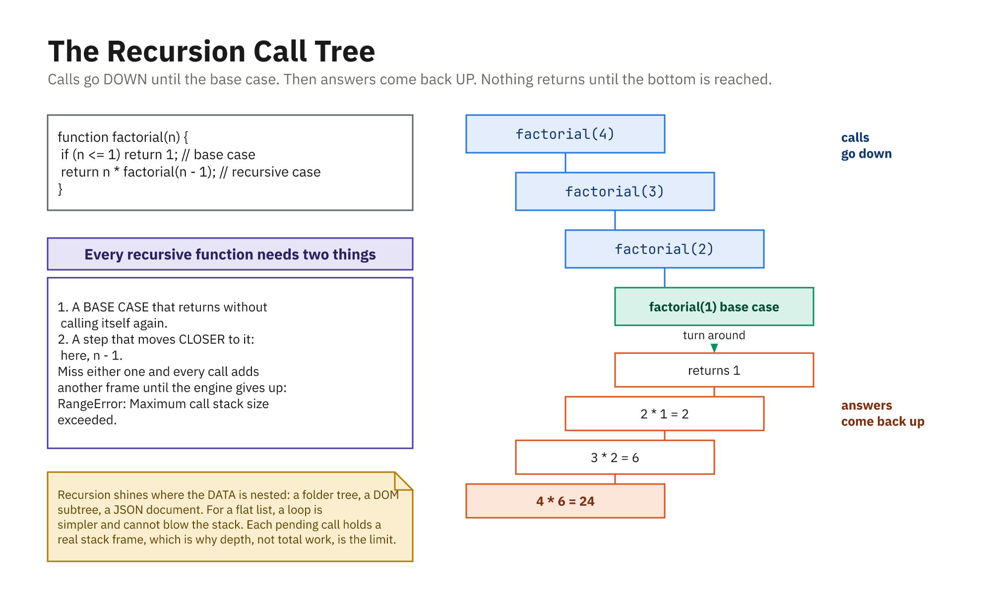

> **Reserve pair.** Runs only if the class finishes `01`-`30`. Recursion is in
> neither the outline nor any exit ticket, so this is the one with no cost to skipping.

## What Is Recursion?

- A function that **calls itself** on a smaller version of the problem
- Every recursive function needs two parts:
  - A **base case** that returns without recursing
  - A **recursive case** that moves *toward* the base case

```js
function countdown(n) {
  if (n <= 0) return;      // base case - stop
  console.log(n);
  countdown(n - 1);        // recursive case - smaller
}

countdown(3); // 3, 2, 1
```

## Forget the Base Case, Blow the Stack

```js
function forever(n) {
  console.log(n);
  forever(n - 1);   // nothing ever stops it
}

forever(3);
// RangeError: Maximum call stack size exceeded
```

- Each call takes a frame on the **call stack**; the stack is finite
- Two failure modes: no base case, or a step that never reaches it
- Check the base case **first**, before doing any work

## Factorial: The Classic

```js
function factorial(n) {
  if (n <= 1) return 1;          // base case
  return n * factorial(n - 1);   // recursive case
}

factorial(5); // 120
```

- Read it as a definition: `5! = 5 × 4!`, and `1! = 1`
- The multiplication happens **on the way back up**, as calls return

## Tracing the Calls

```text
factorial(4)
  4 * factorial(3)
        3 * factorial(2)
              2 * factorial(1)
                    1          <- base case reached
              2 * 1     = 2
        3 * 2           = 6
  4 * 6                 = 24
```

- Calls **stack up** until the base case, then **collapse back**
- Drawing this on the board is worth more than any explanation

## A Running Total

```js
function sumTo(n) {
  if (n <= 0) return 0;      // base case
  return n + sumTo(n - 1);   // recursive case
}

sumTo(5);  // 15
sumTo(10); // 55
```

- Same shape as `factorial`, only the operation and base value differ
- Most simple recursion is this one pattern wearing different clothes

## Fibonacci, Two Ways

```js
// Iterative - one pass, two variables
function fibonacci(n) {
  if (n <= 0) return 0;
  if (n === 1) return 1;
  let a = 0, b = 1;
  for (let i = 2; i <= n; i++) [a, b] = [b, a + b];
  return b;
}

// Recursive - reads like the mathematical definition
function fibRecursive(n) {
  if (n <= 0) return 0;
  if (n === 1) return 1;
  return fibRecursive(n - 1) + fibRecursive(n - 2);
}
```

## The Recursive Version Is Much Slower

```js
fibRecursive(10); // 55 - fine
fibRecursive(40); // 102334155 - takes SECONDS
```

- Each call spawns **two** more, so the work roughly doubles per step
- `fib(40)` makes over 300 million calls, recomputing the same values
- Memoizing it (a closure over a cache) collapses that back to linear
- **Recursion is not automatically elegant: measure it**

## When Recursion Actually Wins

- Not for counting; a loop is clearer and faster
- Use it when the **data is nested to an unknown depth**

```js
function flatten(arr) {
  const out = [];
  for (const item of arr) {
    if (Array.isArray(item)) out.push(...flatten(item)); // recurse
    else out.push(item);
  }
  return out;
}

flatten([1, [2, [3, [4]], 5]]); // [1, 2, 3, 4, 5]
```

- The loop version needs an explicit stack; the recursion just works

## Where You Will Meet It

- Walking a **DOM tree**, elements contain elements
- Reading **nested JSON** from an API
- Traversing a **file system**, folders inside folders
- Any tree, menu, comment thread, or org chart

```js
function countNodes(el) {
  let total = 1;
  for (const child of el.children) total += countNodes(child);
  return total;
}
```

- The rule of thumb: **loop for a list, recurse for a tree**

## Down, Then Back Up



- Calls descend to the base case; nothing returns until the bottom
- Every pending call holds a stack frame, so depth is the limit
