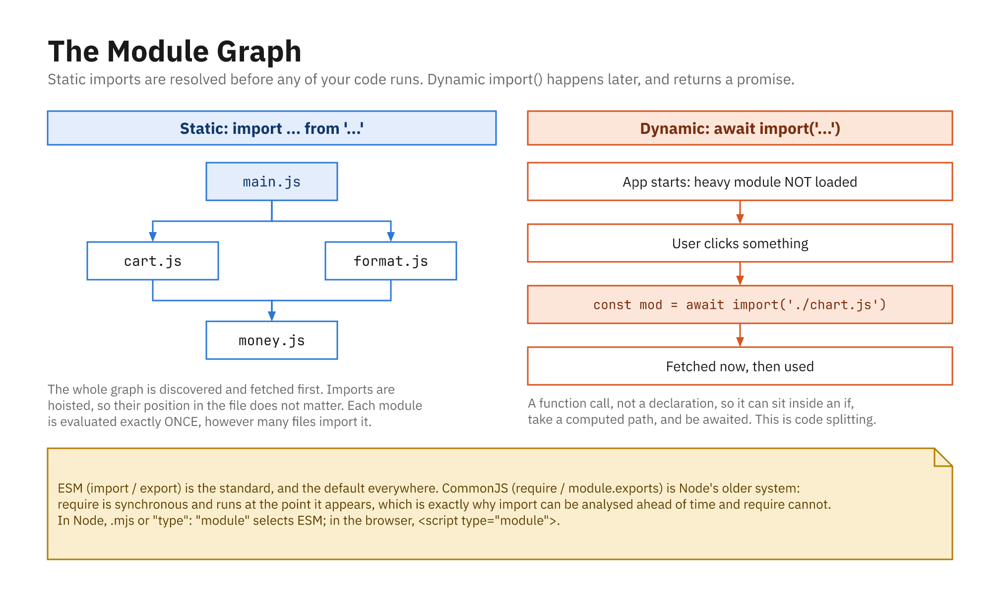

> **Reserve pair.** Runs only if the class finishes `01`-`30`. Note that this is the
> only coverage of outline IX.D, and Module 06's exit ticket asks about `import()`.

## The `import()` Function

- Loads modules **at runtime**, standardized in **ES2020**
- Function-like syntax vs static `import`

```js
// static (ES2015)
import { something } from "./module.js";

// dynamic (ES2020)
import("./module.js").then((module) => {
  // use module
});
```

- `import()` is **asynchronous** and returns a **promise**
- It resolves to a **module namespace object** (its exports)

## Using `import()` with async/await

```js
async function loadMath() {
  try {
    const math = await import("./math.js");
    console.log(math.PI);
    console.log(math.add(2, 3));
    math.default();          // the default export
  } catch (error) {
    console.error("Failed to load module:", error.message);
  }
}
loadMath();
```

- Named exports → `math.add`; default export → `math.default`

## It Can Appear Anywhere

- Unlike static `import`, `import()` works inside functions and conditions

```js
async function setup() {
  if (location.search.includes("debug")) {
    const debug = await import("./debug-tools.js");
    debug.enableDebugMode();
  }
}
```

- The module loads **only when the condition passes**
- Static import is fixed at parse time; dynamic loads on demand

## The Path Can Be Built at Runtime

```js
const name = userChoice;               // "chart" | "table" | "map"
const view = await import(`./views/${name}.js`);
view.render();
```

- Impossible with a static `import`, whose path must be a literal
- This is what powers plugin systems and route-based loading

## Why Bother: Code Splitting

- Static imports all load **before** your app starts
- A large, rarely-used feature makes every visitor wait

```js
// 400 KB chart library - only for the 5% who open the report
document.getElementById("report").addEventListener("click", async () => {
  const { renderChart } = await import("./charts.js");
  renderChart(data);
});
```

- Faster first load; the cost moves to the people who use the feature

## A Module Evaluates Only Once

```js
const a = await import("./setup.js");  // runs the module body
const b = await import("./setup.js");  // cached - body does NOT re-run

console.log(a === b); // true - same namespace object
```

- Import it ten times, it initializes once
- Safe to call in a click handler that fires repeatedly

## Failure Is a Rejected Promise

```js
try {
  const mod = await import("./maybe-missing.js");
} catch (error) {
  console.warn("Optional feature unavailable:", error.message);
}
```

- A static `import` of a missing file fails **before your code runs**
- A dynamic one fails **where you called it**, so you can recover
- Always wrap it: network hiccups make this a real path, not a rare one

## Static and Dynamic Together

```js
// main.js, loaded with <script type="module">
import { setupPage } from "./setup.js";   // needed always - static
setupPage();

document.getElementById("debug-btn")
  .addEventListener("click", async () => {
    const debug = await import("./debug-tools.js"); // rarely - dynamic
    debug.openPanel();
  });
```

- Core code up front, optional features on demand

## Static and Dynamic, Together



- `import()` is a function call, so it can sit inside an `if`
- It returns a promise; that is what makes code splitting possible
